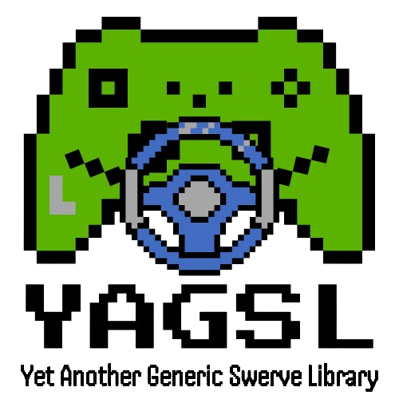

# Welcome to Yet Another Swerve Document


If your swerve drive uses only [CANivore](https://store.ctr-electronics.com/canivore/), [Falcon500](https://store.ctr-electronics.com/falcon-500-powered-by-talon-fx/)/[Kraken](https://store.ctr-electronics.com/kraken-x60/)/[TalonFXS](https://store.ctr-electronics.com/products/talon-fxs), [Pigeon2.0](https://store.ctr-electronics.com/pigeon-2/), and [CANCoder](https://store.ctr-electronics.com/cancoder/) from [CTRE](https://pro.docs.ctr-electronics.com/en/latest/index.html) please use the [Tuner X Swerve Drive Generator](https://pro.docs.ctr-electronics.com/en/latest/docs/tuner/tuner-swerve/index.html)!


<figure><figcaption></figcaption></figure>

## Overview

YAGSL is a Swerve Library Developed by current and former BroncBotz mentors for all FRC Teams. The goal of YAGSL is to help teams of all experience levels with all types of swerve modules to control their swerve drive as easy as a `DifferentialDrive` we all know.  YAGSL is well documented, actively maintained, and always accepting help!




## Our Philosophy

Your program does not revolve around your swerve drive. Your constants file doesn't have to take 10 minutes to find the right option. Different robots should be able to work with the same code.&#x20;

## Why do we exist?

Most swerve drive code out there are templates that teams are just expected to modify and fit to their robot. They are not generic and require a lot of time and effort to get working. Even after all of that effort there may be bugs that exist which may have been there all along or one of the changes you made doesn't work as you expected, etc... There is a better way!&#x20;

Do you have multiple robots and don't want to change any code to get them to work the same? YAGSL has come to to the rescue! We make it so all you have to do to get a robot working with the same code is create a configuration directory!

## Quick links


[what-we-do.md](overview/what-we-do.md)



[our-features](overview/our-features/)


## Get Started

We've put together some helpful guides for you to get setup with our product quickly and easily.


[swerve-drive.md](fundamentals/swerve-drive.md)



[getting-to-know-your-robot](configuring-yagsl/getting-to-know-your-robot/)



[configuration](configuring-yagsl/configuration/)



[dependency-installation.md](configuring-yagsl/dependency-installation.md)



[code-setup.md](configuring-yagsl/code-setup.md)



[frc-web-components.md](analytics-and-debugging/frc-web-components.md)



[when-to-invert.md](configuring-yagsl/when-to-invert.md)



[how-to-tune-pidf.md](configuring-yagsl/how-to-tune-pidf.md)



[the-eight-steps.md](configuring-yagsl/the-eight-steps.md)


## YAGSL Online Installation

```
https://broncbotz3481.github.io/YAGSL-Lib/yagsl/yagsl.json
```
