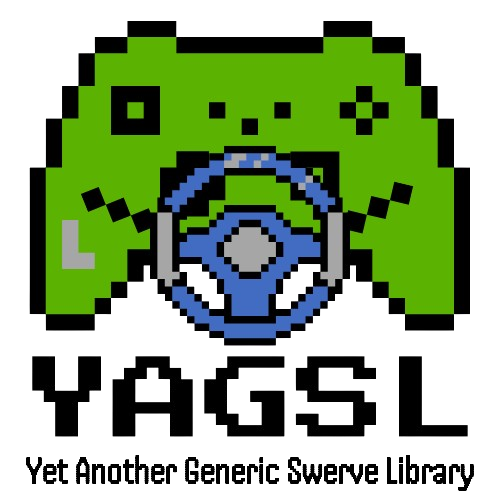

# Welcome to YAGSL


If your swerve drive uses only [Falcon500](https://store.ctr-electronics.com/falcon-500-powered-by-talon-fx/)/[Kraken](https://store.ctr-electronics.com/kraken-x60/)/[TalonFXS](https://store.ctr-electronics.com/products/talon-fxs), [Pigeon2.0](https://store.ctr-electronics.com/pigeon-2/), and [CANCoder](https://store.ctr-electronics.com/cancoder/) from [CTRE](https://pro.docs.ctr-electronics.com/en/latest/index.html) please also consider the [Tuner X Swerve Drive Generator](https://pro.docs.ctr-electronics.com/en/latest/docs/tuner/tuner-swerve/index.html)!


<figure><figcaption></figcaption></figure>

## Overview

YAGSL is a Swerve Library developed by current and former BroncBotz mentors for all FRC teams. YAGSL
is a JSON configuration parser that builds a [YAMS](https://yams.yamgen.com/) `SwerveDrive` for
your robot — describe your hardware once, generate the config at
**[config.yagsl.com](https://config.yagsl.com)**, and drive. See
[What is YAGSL?](explanation/what-is-yagsl.md) for how the pieces fit together.



## This documentation is organized into four sections

* **[Tutorial](tutorial/README.md)** — never used YAGSL before? Start here. A single linear
  walkthrough from a bare WPILib project to a driving swerve robot.
* **[How-to Guides](how-to/how-to.md)** — already have a robot running? Task-focused recipes for
  tuning PIDF, determining inversion, diagnosing drift, and other work you'll come back to.
* **[Reference](reference/reference.md)** — precise JSON schema field tables, supported hardware
  type strings, and where to find the YAMS API docs.
* **[Explanation](explanation/explanation.md)** — swerve drive theory and the reasoning behind how
  YAGSL and YAMS behave.


Upgrading an existing robot from before **2026.8.05**? Your `swerve/` config directory uses the old
schema — see [Schema Changes](reference/schema-changes.md) before you do anything else.


## Get started




[Your First Swerve Robot](tutorial/README.md)



[Tune PIDF gains](how-to/tune-pidf-gains.md)



[The 8 steps](how-to/the-8-steps.md)



[Schema Changes](reference/schema-changes.md)


## YAGSL Online Installation

```
https://yet-another-software-suite.github.io/YAGSL/yagsl/yagsl.json
```

## Our Philosophy

Your program does not revolve around your swerve drive. Your constants file doesn't have to take 10
minutes to find the right option. Different robots should be able to work with the same code — swap
the `swerve/` config directory and the same subsystem code drives a different robot.
