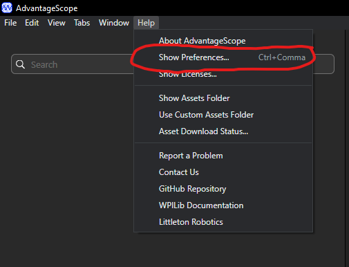
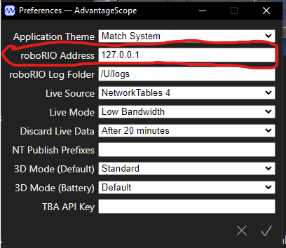
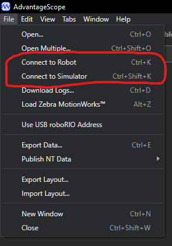
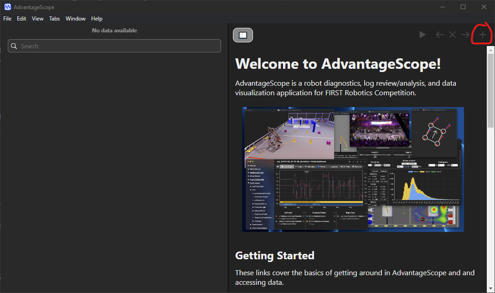
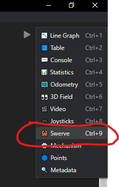
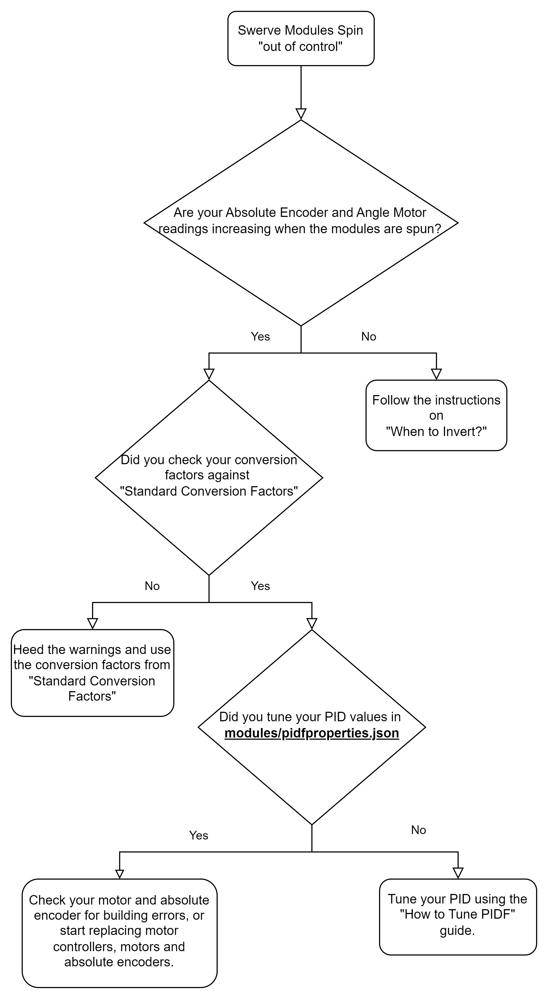

# Advantage Scope

## Opening

Since the 2024 Season, [Advantage Scope](https://github.com/Mechanical-Advantage/AdvantageScope) has been included with the WPILib installation. There is no external download required, however with every WPILib update you should re-download the [WPILib installer](https://docs.wpilib.org/en/stable/docs/zero-to-robot/step-2/wpilib-setup.html) to get the latest version of WPILib tools.

## Configuring Advantage Scope

1. Connect laptop to robot
2. Open `AdvantageScope (WPILib)` or in VS Code open the command palette and type in `WPILib: Start Tool` and click `AdvantageScope`
3. Click `Help` then `Show Preferences`

<figure><figcaption>
Advantage Scope's help menu
</figcaption></figure>

4. Input the roboRIO IP address based off of your team number. `10.TE.AM.2`

<figure><figcaption>
roboRIO Address field highlighted
</figcaption></figure>

5. Connect to the robot (or the simulator)

<figure><figcaption>
Connect to Robot menu
</figcaption></figure>

6. Add a new tab by clicking the `+` on the right side of the window

<figure><figcaption>
Add new tab
</figcaption></figure>

7. Add a new :crab: Swerve tab

<figure><figcaption>
Swerve tab
</figcaption></figure>

8.  Connect the module states and rotation from Smart Dashboard to the Fields.

    1. Under the `SmartDashboard/swerve` menu drag the everything from `advantagescope/` into the `Sources` field.
    2. You may need to enable your robot before you can add `SmartDashboard/swerve/advantagescope/desiredStates`

    <figure><figcaption></figcaption></figure>
9.  Adjust the Data column to your Swerve Drive's properties.

    1. Under the `Data` column change the `Max Speed` field to the value of `SmartDashboard/swerve/maxSpeed` entry.

    <figure><figcaption></figcaption></figure>
10. (Optional) Adjust the Display column to accurately display your robot's chassis dimensions by changing the Size (Left-Right) and Size (Front-Back) to match what is under `SmartDashboard/swerve/sizeLeftRight` and `SmartDashboard/swerve/sizeFrontBack`

<figure><figcaption></figcaption></figure>

## Overview

<figure><figcaption>
Swerve Drivebase while in motion with an incorrect configuration. (Need to change this to an actual picture of Advantage Scope)
</figcaption></figure>


The **RED** lines are the measured velocity and position of the swerve module.

The **BLUE** lines is the velocity and position of the module sent!

