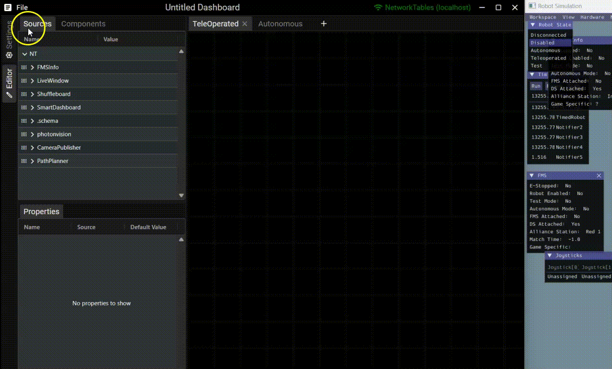
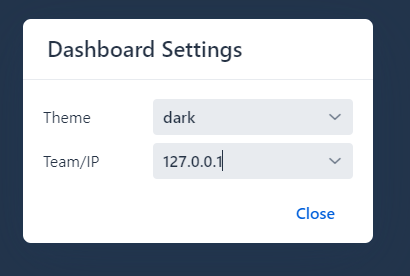
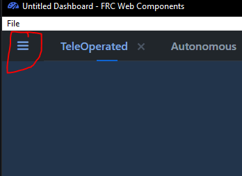

# FRC Web Components

FRC Web Components is an easy way to visualize the Swerve Drive and give helpful feedback to YAGSL developers to aid you.

## Download

To download and install this please choose the correct file and run it from this page.\



## Configuring FRC Web Components

<figure><figcaption></figcaption></figure>

1. Connect the laptop to the robot
2. Open "FRC Web Components"
3. Click "Settings"

<figure><figcaption>
FRC Web Components with Settings highlighted
</figcaption></figure>

4. Input the roboRIO IP address based off of your team number. `10.TE.AM.2`



<figure><figcaption>
Dashboard settings for FRC Web Components.
</figcaption></figure>

5. Open the widget menu.

<figure><figcaption>
Press here.
</figcaption></figure>

6. Select the `Swerve Drivebase` and click `Append`

<figure><figcaption></figcaption></figure>

7. Click on the widget.
8. Click "Connect to data source..."

<figure><figcaption></figcaption></figure>

9. Connect to `SmartDashboard/swerve` by pressing select here.

<figure><figcaption></figcaption></figure>

10. Press "Close"

## Overview

<figure><figcaption>
Swerve Drivebase while in motion with an incorrect configuration.
</figcaption></figure>


The **BLUE** lines are the measured velocity and position of the swerve module.

The **RED** lines is the velocity and position of the module sent!

