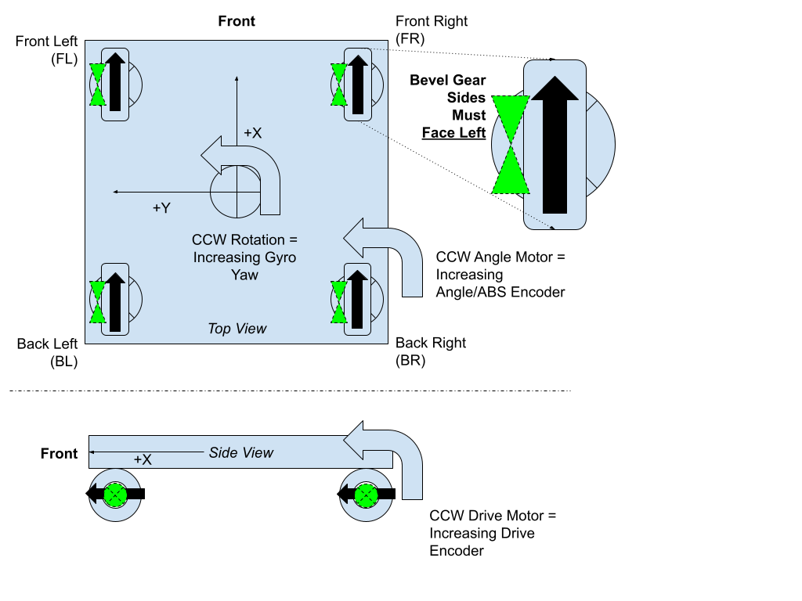

# Creating your first configuration

## DevilBotz 2876 Swerve Bring-Up Checklist

Compliments of the [DevilBotz 2876](https://www.thebluealliance.com/team/2876/2024)!

Updated: 2024-01-24

## Resources

* [ ] [YAGSL Wiki](https://yagsl.gitbook.io/yagsl/) - [https://yagsl.gitbook.io/yagsl/](https://yagsl.gitbook.io/yagsl/)
* [ ] [REV Robotics Hardware Client](https://docs.revrobotics.com/rev-hardware-client/) - [https://docs.revrobotics.com/rev-hardware-client/](https://docs.revrobotics.com/rev-hardware-client/)
  * _for configuring Spark Max Motor Controllers and other Rev devices_
* [ ] [Phoenix Tuner X](https://pro.docs.ctr-electronics.com/en/stable/docs/hardware-reference/cancoder/index.html) - [https://v6.docs.ctr-electronics.com/en/stable/docs/tuner/index.html](https://v6.docs.ctr-electronics.com/en/stable/docs/tuner/index.html)
  * _for configuring CanCoders and other CTR devices_

## Swerve Orientation Diagram

&#x20;_Note: When viewed from the top, make sure the sides of the wheel with the bevel gear are pointing to the **left**_

<figure><figcaption></figcaption></figure>

### Step 1: Module Types

|                    | **Model, Version, Etc** |
| ------------------ | ----------------------- |
| _Motor_            |                         |
| _Controller_       |                         |
| _Absolute Encoder_ |                         |
| _IMU_              |                         |

### Step 2: Build Specific Details

1. Measure the module center relative to the robot center

|                    | **Location (inches)** |       |   |   |
| ------------------ | --------------------- | ----- | - | - |
| **Module**         | **X**                 | **Y** |   |   |
| _Front Left (FL)_  | +                     |       | + |   |
| _Front Right (FR)_ | +                     |       | - |   |
| _Back Left (BL)_   | -                     |       | + |   |
| _Back Right (BR)_  | -                     |       | - |   |

2. Measure the wheel diameter _in meters_
3. Determine the _reported_ internal encoder resolution
   * _Note: Most encoders now normalize the reported values to -1 to 1, so the Encoder Resolution when computing the conversion factors should generally be “1”. One known exception is the TalonSRX._
4. Find the drive/angle gear ratio from the swerve module manufacturer specs
5. Calculate the drive/angle conversion factors
   * Drive Motor Conversion Factor (meters/rotation) = (PI \* WHEEL DIAMETER IN METERS) / (GEAR RATIO \* ENCODER RESOLUTION)
   * Angle Motor Conversion Factor (degrees/rotation) = 360 / (GEAR RATIO \* ENCODER RESOLUTION)

_Note: For Absolute Encoders attached **directly** to the dataport on the SparkMAX, the Conversion Factor is **360**_

| **Motor** | **Wheel Diameter (meters)** | **Gear Ratio** | **Encoder Resolution (CPR)** | **Conversion Factor** |
| --------- | --------------------------- | -------------- | ---------------------------- | --------------------- |
| _Drive_   |                             |                |                              |                       |
| _Angle_   | **N/A**                     |                |                              |                       |

### Step 3: Electrical Characteristics

1. Set/Verify the CAN IDs for each module
2. Check Inversion
   * Rotate the _drive_ wheel **CCW** (moving “forward”)
     1. The built-in encoder value should **increase**. If not, _invert_ the drive motor.
   * Rotate the _angle_ wheel **CCW** (when viewed from the top)
     1. The built-in encoder value should **increase**. If not, _invert_ the angle motor.
     2. The absolute encoder value should **increase**. If not, _invert_ the absolute encoder.
   * Rotate the entire _robot_ **CCW**. The gyro angle (yaw) should **increase**. If not, _invert_ the IMU

_Note: If you are using the hardware utilities for accessing the motors controllers and/or absolute encoders, the RoboRio must **not** be active on the CAN bus. The most reliable way to disable the RoboRio is to temporarily disconnect it from power._

|                    | **Motor/Encoder CAN IDs** | **Inverted?** |                      |           |           |                      |         |
| ------------------ | ------------------------- | ------------- | -------------------- | --------- | --------- | -------------------- | ------- |
| **Module**         | **Drive**                 | **Angle**     | **Absolute Encoder** | **Drive** | **Angle** | **Absolute Encoder** | **IMU** |
| _Front Left (FL)_  |                           |               |                      |           |           |                      |         |
| _Front Right (FR)_ |                           |               |                      |           |           |                      |         |
| _Back Left (BL)_   |                           |               |                      |           |           |                      |         |
| _Back Right (BR)_  |                           |               |                      |           |           |                      |         |

### Step 4: Absolute Encoder Offsets

1. Turn Robot On (Disabled so the wheels can be turned manually)
2. Manually Turn All 4 wheels so that they are all pointing forward and forward rotation results in increasing drive encoder values (see the black arrows in [Orientation Diagram](creating-your-first-configuration.md#swerve-orientation-diagram-1)).
3. Measure the absolute encoder value for each module (the offset is the **negative** of the value reported)

| **Module**          | **Angle Absolute **_**Offset**_ |   |
| ------------------- | ------------------------------- | - |
| **(rotations 0-1)** | **(degrees 0-360)**             |   |
| _Front Left (FL)_   |                                 |   |
| _Front Right (FR)_  |                                 |   |
| _Back Left (BL)_    |                                 |   |
| _Back Right (BR)_   |                                 |   |

### Step 5: Input data into the configuration webpage

Open the webpage and import your data into the config files. \
[https://broncbotz3481.github.io/YAGSL-Example/](https://broncbotz3481.github.io/YAGSL-Example/)


[Broken link](broken-reference)


