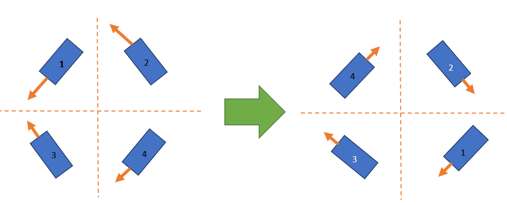

# Configuration

Tuning Webpage

YAGSL maintains a somewhat complete configuration tool to aid you in creating configuration files from scratch here.




**IF** you are using an Absolute Encoder which is attached to your SparkMAX then the `angle` conversion factor is `360`.


From this webpage you should be able to download all files and place them into your `deploy` directory to use for [`new SwerveParser(new File(Filesystem.getDeployDirectory(),"swerve")`](https://broncbotz3481.github.io/YAGSL/swervelib/parser/SwerveParser.html#%3Cinit%3E\(java.io.File\))[`.createSwerveDrive(Units.feetToMeters(4.5));`](https://broncbotz3481.github.io/YAGSL/swervelib/parser/SwerveParser.html#createSwerveDrive\(double\)) .

We also maintain a repository for known working configurations here!



## Make sure you know what module is what!

If not your modules could end up like this!.

<figure><figcaption><p>Modules flipped around, spinning CCW+</p></figcaption></figure>

This happens when you input module locations incorrectly due to where the gyroscope is oriented on the robot or you have the device configurations in the wrong module locations in the configuration files. **If this happens to you, you HAVE misconfigured your modules.**

<details>

<summary>How to swap module configurations</summary>

For the examples we label with numbers as to be less confused, however when changing module files around we assign the numbers to the respective initial module configuration names. For the example above we have as follows

1. `frontleft.json`
2. `frontright.json`
3. `backleft.json`
4. `backright.json`

#### Swapping `frontleft.json` with `backleft.json`

<pre class="language-json" data-title="frontleft.json"><code class="lang-json">{
<strong>  "drive": {
</strong><strong>    "type": "sparkmax",
</strong><strong>    "id": 4,
</strong><strong>    "canbus": null
</strong><strong>  },
</strong><strong>  "angle": {
</strong><strong>    "type": "sparkmax",
</strong><strong>    "id": 3,
</strong><strong>    "canbus": null
</strong><strong>  },
</strong><strong>  "encoder": {
</strong><strong>    "type": "cancoder",
</strong><strong>    "id": 9,
</strong><strong>    "canbus": null
</strong><strong>  },
</strong><strong>  "inverted": {
</strong><strong>    "drive": false,
</strong><strong>    "angle": false
</strong><strong>  },
</strong><strong>  "absoluteEncoderOffset": -114.609,
</strong>  "location": {
    "front": 12,
    "left": 12
  }
}
</code></pre>

<pre class="language-json" data-title="backleft.json"><code class="lang-json"><strong>{
</strong><strong>  "drive": {
</strong><strong>    "type": "sparkmax",
</strong><strong>    "id": 7,
</strong><strong>    "canbus": null
</strong><strong>  },
</strong><strong>  "angle": {
</strong><strong>    "type": "sparkmax",
</strong><strong>    "id": 8,
</strong><strong>    "canbus": null
</strong><strong>  },
</strong><strong>  "encoder": {
</strong><strong>    "type": "cancoder",
</strong><strong>    "id": 12,
</strong><strong>    "canbus": null
</strong><strong>  },
</strong><strong>  "inverted": {
</strong><strong>    "drive": false,
</strong><strong>    "angle": false
</strong><strong>  },
</strong><strong>  "absoluteEncoderOffset": 6.504,
</strong>  "location": {
    "front": -12,
    "left": 12
  }
}
</code></pre>

Swap the highlighted lines and you have swapped the module configurations correctly.

## The easy way

1. Change the location negations to the desired module side.
2. Rename the files without overwriting eachother.

</details>

#### Example configuration challenge

<details>

<summary>Challenge</summary>


Here is a challenge for you, how can you solve this misconfiguration?


</details>

<details>

<summary>Solution</summary>




Steps:

1. Invert 4 and 2.
2. Swap 1 and 4.

</details>

This may help you in your endeavors!



## Orient your swerve modules correctly!

To correctly get the `absoluteEncoderOffset` your swerve modules must be facing this way while reading the values.

<figure><figcaption></figcaption></figure>

## Configuration Directory

### JSON Files

JSON stands for "JavaScript Object Notation" it is a popular format for configuration, and string data representation. Learn more [here](https://www.w3schools.com/js/js\_json\_intro.asp)

### What does the swerve directory need to look like?

The swerve directory for generating a swerve drive must look like this. Assuming you have defined your swerve modules as `"modules": [ "frontleft.json", "frontright.json", "backleft.json", "backright.json"]` in [`swervedrive.json`](swerve-drive-configuration.md).

```
└── swerve
    ├── controllerproperties.json
    ├── modules
    │   ├── backleft.json
    │   ├── backright.json
    │   ├── frontleft.json
    │   ├── frontright.json
    │   ├── physicalproperties.json
    │   └── pidfproperties.json
    └── swervedrive.json
```

The `modules` folder, [`controllerproperties.json`](controller-properties-configuration.md), [`physicalproperties.json`](physical-properties-configuration.md), [`pidfproperties.json`](pidf-properties-configuration/), and [`swervedrive.json`](swerve-drive-configuration.md) files are necessary to build the swerve drive. Each one has specific fields which correspond to an attribute of the swerve drive, some physical and some abstract.

## Migrating Old Configuration Files

1. Delete `wheelDiamter`, `gearRatio`, `encoderPulsePerRotation` from `physicalproperties.json`
2. Add `optimalVoltage` to `physicalproperties.json`
3. Delete `maxSpeed` and `optimalVoltage` from `swervedrive.json`
4. **IF** a swerve module doesn't have the same drive motor or steering motor as the rest of the swerve drive you **MUST** specify a `conversionFactor` for BOTH the drive and steering motor in the modules configuration JSON file. IF one of the motors is the same as the rest of the swerve drive and you want to use that `conversionFactor`, set the `conversionFactor` in the module JSON configuration to 0.
5. You MUST specify the maximum speed when creating a `SwerveDrive` through `new SwerveParser(directory).createSwerveDrive(maximumSpeed);`
6. IF you do not want to set `conversionFactor` in `swervedrive.json`. You can pass it into the constructor as a parameter like this

```java
double DriveConversionFactor = SwerveMath.calculateMetersPerRotation(Units.inchesToMeters(WHEEL_DIAMETER), GEAR_RATIO, ENCODER_RESOLUTION);
double SteeringConversionFactor = SwerveMath.calculateDegreesPerSteeringRotation(GEAR_RATIO, ENCODER_RESOLUTION);
new SwerveParser(directory).createSwerveDrive(maximumSpeed, SteeringConversionFactor, DriveConversionFactor);
```
