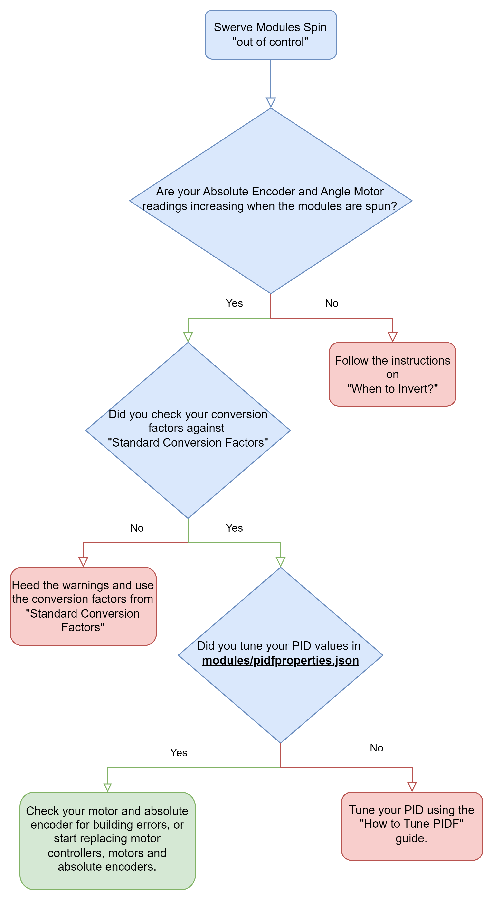

# Flowcharts

## Swerve Drive Diagram

<figure><figcaption></figcaption></figure>

## Swerve Modules

### Swerve modules spinning "out of control"

<figure><figcaption></figcaption></figure>

## Swerve Module does not spin correctly.

I will add a flow chart for this later but essentially its.

1. Are the CAN ID's, motor types, and absolute encoder types correct?
2. Are the module locations correct?
3. Do you use an absolute magnetic encoder
   1. Did you loctite your magnet in
   2. Do you have a good (green LED normally) reading on the magnet.
4. Did you set the absolute encoder offset while the wheels had the bevel facing the left and wheels straight front to back.
5. Did you check [when-to-invert.md](when-to-invert.md "mention") for inversion states?
6. Did you tune your PID?

## Swerve Drive "spins out of control"

<figure><figcaption></figcaption></figure>
