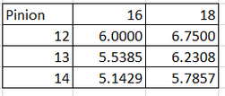

# Standard Conversion Factors

This page serves a standard set of conversion factors for a few typical modules.


IF you are using absolute encoders attached to your SparkMAX data port (on the top of the SparkMAX) the `angle` conversion factor should be set to `360`!

For example an MK4i L1 with an absolute encoder attached to the SparkMAX (like a `CanandMag`) should be set with these conversion factors.

```json
"conversionFactors": {
	"angle": {"factor": 360},
	"drive": {"gearRatio": 8.14, "diameter": 4}
}
```


## How I found these?

```java
    // Angle conversion factor is 360 / (GEAR RATIO)
    //  In this case the gear ratio is 12.8 motor revolutions per wheel rotation.
    //  The encoder resolution per motor revolution is 1 per motor revolution.
    double angleConversionFactor = SwerveMath.calculateDegreesPerSteeringRotation(12.8);
    // Motor conversion factor is (PI * WHEEL DIAMETER IN METERS) / (GEAR RATIO).
    //  In this case the wheel diameter is 4 inches, which must be converted to meters to get meters/second.
    //  The gear ratio is 6.75 motor revolutions per wheel rotation.
    //  The encoder resolution per motor revolution is 1 per motor revolution.
    double driveConversionFactor = SwerveMath.calculateMetersPerRotation(Units.inchesToMeters(4), 6.75);
    System.out.println("\"conversionFactors\": {");
    System.out.println("\t\"angle\": {\"factor\": " + angleConversionFactor + "},");
    System.out.println("\t\"drive\": {\"factor\": " + driveConversionFactor + "}");
    System.out.println("}");
```

## MAX Swerve



```json
"conversionFactors": {
    "angle": {"gearRatio": 46.42},
    "drive": {"gearRatio": 5.50, "diameter": 3}
}
```



```json
"conversionFactors": {
    "angle": {"gearRatio": 46.42},
    "drive": {"gearRatio": 5.08, "diameter": 3}
}
```



```json
"conversionFactors": {
    "angle": {"gearRatio": 46.42},
    "drive": {"gearRatio": 4.71, "diameter": 3}
}
```



## Swerve Drive Specialties (SDS)



```json
"conversionFactors": {
	"angle": {"gearRatio": 21.4285714286},
	"drive": {"gearRatio": 8.14, "diameter": 4}
}
```



```json
"conversionFactors": {
	"angle": {"gearRatio": 21.4285714286},
	"drive": {"gearRatio": 6.75, "diameter": 4}
}
```



```json
"conversionFactors": {
	"angle": {"gearRatio": 21.4285714286},
	"drive": {"gearRatio": 6.12, "diameter": 4}
}
```





```json
"conversionFactors": {
	"angle": {"gearRatio": 12.8},
	"drive": {"gearRatio": 8.14, "diameter": 4}
}
```



```json
"conversionFactors": {
	"angle": {"gearRatio": 12.8},
	"drive": {"gearRatio": 6.75, "diameter": 4}
}
```



```json
"conversionFactors": {
	"angle": {"gearRatio": 12.8},
	"drive": {"gearRatio": 6.12, "diameter": 4}
}
```



```json
"conversionFactors": {
	"angle": {"gearRatio": 12.8},
	"drive": {"gearRatio": 5.14, "diameter": 4}
}
```





```json
"conversionFactors": {
	"angle": {"gearRatio": 18.75},
	"drive": {"gearRatio": 7.13, "diameter": 4}
}
```



```json
"conversionFactors": {
	"angle": {"gearRatio": 18.75},
	"drive": {"gearRatio": 5.9, "diameter": 4}
}
```



```json
"conversionFactors": {
	"angle": {"gearRatio": 18.75},
	"drive": {"gearRatio": 5.36, "diameter": 4}
}
```



## Thrifty Swerve



<figure><figcaption><p>Thrifty Swerve Gear Ratio Table</p></figcaption></figure>

The following example is for 18T Output Gear, and 12T pinion gear with a 3in wheel controlled by NEOs. Please refer to the chart above for your configuration.

The steering motor gear ratio is **25:1**

```json
"conversionFactors": {
	"angle": {"gearRatio": 25},
	"drive": {"gearRatio": 15, "diameter": 3}
}
```





<figure><figcaption><p>Thrifty Swerve Gear Ratio Table</p></figcaption></figure>

The following example is for 16T Output Gear, and 12T pinion gear with a 3in wheel controlled by NEOs. Please refer to the chart above for your configuration.&#x20;

The steering motor gear ratio is **25:1**

```json
"conversionFactors": {
	"angle": {"gearRatio": 25},
	"drive": {"gearRatio": 16.9, "diameter": 3}
}
```




## Plummer Industries



```json
"conversionFactors": {
	"angle": {"gearRatio": 28},
	"drive": {"gearRatio": 4, "diameter": 2.5}
}
```



```json
"conversionFactors": {
	"angle": {"gearRatio": 28},
	"drive": {"gearRatio": 3.25, "diameter": 2.5}
}
```





```json
"conversionFactors": {
	"angle": {"gearRatio": 28},
	"drive": {"gearRatio": 4, "diameter": 2.5}
}
```



```json
"conversionFactors": {
	"angle": {"gearRatio": 28},
	"drive": {"gearRatio": 3.25, "diameter": 2.5}
}
```




