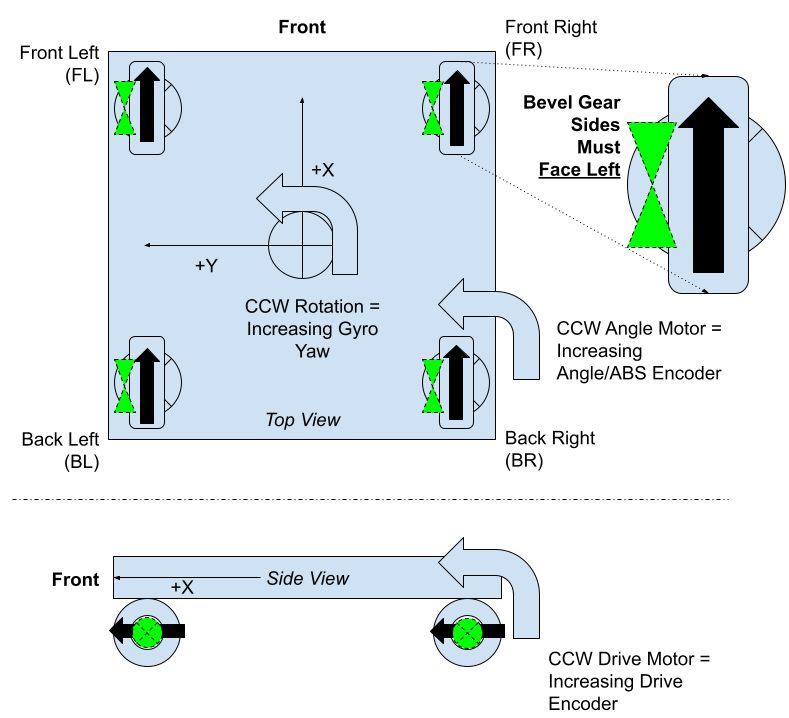
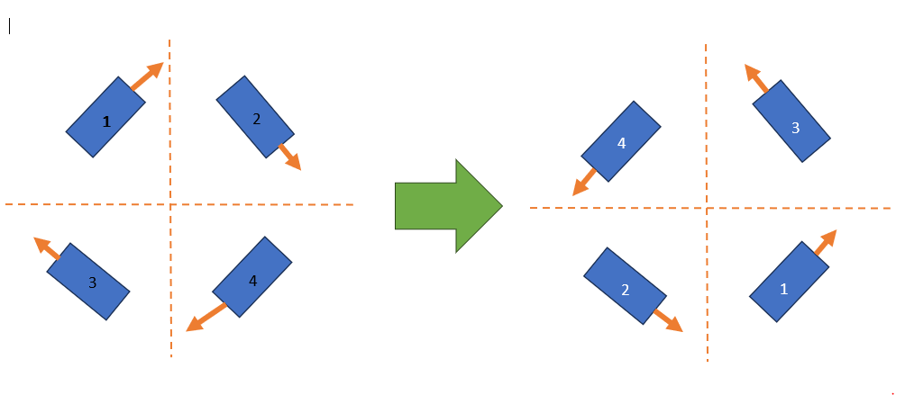

# When to invert?

Swerve Modules and Swerve Drives require some inversions to get working properly. The goal is to get everything to increase counter clockwise positive!


When your gears are grinding on the ground but not while on blocks and your wheels are facing and spinning in the right directions you may need to tune PID instead of inverting!



IF you are inverted incorrectly your modules or robot may spin "out-of-control"


## Swerve Motors

When you spin your motor counterclockwise the value in Shuffleboard/NetworkTables `Module[...] Raw Absolute Encoder` and `Module[...] Raw Angle Encoder` should both increase.

## How to open Shuffleboard

1. Open shuffleboard.
2.

    <figure><figcaption>
Open network tables
</figcaption></figure>

3.

    <figure><figcaption></figcaption></figure>

4. Take note of the `Module[...] Raw Absolute Encoder` value's and use them for `absoluteEncoderOffset` in the module JSONs.

## Spin your module counterclockwise


Spin your modules **COUNTERclockwise** from the top down view.


<figure><figcaption>
Purple shows the way your bevels should be facing (photo by Team 2876)
</figcaption></figure>

The swerve drive should be on it's side or otherwise lifted. Your swerve module bevels must be facing the left like shown. To rotate the swerve modules they must be rotated counterclockwise like shown.

### If the `Module[...] Raw Angle Encoder` is decreasing...

Invert your angle motor for every module that is decreasing!

<pre class="language-json"><code class="lang-json">{
  "drive": {
    "type": "sparkmax",
    "id": 2,
    "canbus": null
  },
  "angle": {
    "type": "sparkmax",
    "id": 1,
    "canbus": null
  },
  "encoder": {
    "type": "cancoder",
    "id": 10,
    "canbus": null
  },
  "inverted": {
    "drive": false,
<strong>    "angle": true
</strong>  },
  "absoluteEncoderInverted": false,
  "absoluteEncoderOffset": -50.977,
  "location": {
    "front": 12,
    "left": -12
  }
}
</code></pre>

### If the `Module[...] Raw Absolute Encoder` is decreasing...

Invert the absolute encoder in the module JSON with `absoluteEncoderInverted` as shown here.

<pre class="language-json"><code class="lang-json">{
  "drive": {
    "type": "sparkmax",
    "id": 2,
    "canbus": null
  },
  "angle": {
    "type": "sparkmax",
    "id": 1,
    "canbus": null
  },
  "encoder": {
    "type": "cancoder",
    "id": 10,
    "canbus": null
  },
  "inverted": {
    "drive": false,
    "angle": false
  },
<strong>  "absoluteEncoderInverted": true,
</strong>  "absoluteEncoderOffset": -50.977,
  "location": {
    "front": 12,
    "left": -12
  }
}
</code></pre>

## Spin your wheel counterclockwise


Sometimes you may need to invert these if when you rotate the robot changes it's front/back while driving in field-oriented mode.


### If the `Module[...] Raw Drive Encoder` is decreasing...

Invert your drive motor for every module that is decreasing!

<pre class="language-json"><code class="lang-json">{
  "drive": {
    "type": "sparkmax",
    "id": 2,
    "canbus": null
  },
  "angle": {
    "type": "sparkmax",
    "id": 1,
    "canbus": null
  },
  "encoder": {
    "type": "cancoder",
    "id": 10,
    "canbus": null
  },
  "inverted": {
<strong>    "drive": true,
</strong>    "angle": false
  },
  "absoluteEncoderInverted": false,
  "absoluteEncoderOffset": -50.977,
  "location": {
    "front": 12,
    "left": -12
  }
}
</code></pre>

## Rotate your robot counterclockwise


Keep in mind that your robot spinning counter clockwise should look like this when the wheels are powered! You **WILL** need to change your IDs for each module file if they don't.


<figure><figcaption>
ID's relocated in swerve module files
</figcaption></figure>

You should notice the `Raw IMU Yaw` field in Shuffleboard increase. If it doesn't you need to invert your IMU like this.

<pre class="language-json"><code class="lang-json">{
  "imu": {
    <a data-footnote-ref href="#user-content-fn-1">"type": "pigeon2"</a>,
    "id": 13,
    "canbus": "canivore"
  },
<strong>  "invertedIMU": true,
</strong>  "modules": [
    "frontleft.json",
    "frontright.json",
    "backleft.json",
    "backright.json"
  ]
}
</code></pre>

[^1]: See more information [gyroscope.md](../devices/gyroscope.md "mention")
