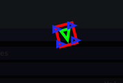

# Swerve Drive Kinematics

<figure><figcaption>
Swerve Drive simulation
</figcaption></figure>

## Tips while building a Swerve Drive

* Center the gyroscope in the robot, this will help prevent a small drift and ensure more accurate odometry.
* Make sure the magnets (if you're using them) are glued in right!
* Set aside time, assume you will mess up building 1 module or otherwise need a spare during competitions.
* Programming a Swerve Drive is hard, and while YAGSL/YAMS try to make it easier there are many things you must know to fully understand what you are doing!
* Use the right tools for the job! Debugging a Swerve Drive is difficult enough by text only, try out a dashboard like [AdvantageScope](https://github.com/Mechanical-Advantage/AdvantageScope/tree/main) — it has excellent visualization tools that are sure to help you out! See [how to set up AdvantageScope](../how-to/set-up-advantagescope.md).

## The Basics

Swerve Drives move around by moving each wheel to a specific angle/azimuth and rotating the wheel to go in that direction. Swerve Drives are unique because they can rotate independently of their translational movement, meaning you can move in any direction while facing any direction. As a result you can "turn in-place" and rotate while moving around an area. The rotation of your robot is referred to as the **heading.**

## What is a Swerve Drive?

A Swerve Drive typically consists of 4 Swerve Modules (which are in essence a drive motor, an angle/azimuth motor, and an absolute encoder), and a gyroscope (centered is best). The motors, absolute encoders, and gyroscope do not matter and can all work together with varying degrees of success. As a rule of thumb, if you can stick to one system do it (all REV, all CTRE) — this will give you the best feature set, however they are not required to be the same! For all other use cases YAGSL is the best choice because it (and YAMS underneath it) was built with abstraction in mind, making all sensors and motor controllers functionally equivalent.

#### TL;DR

A swerve drive is composed of

* [ ] Gyroscope
* [ ] Swerve Module
  * [ ] Angle/Azimuth Motor (+ controller)
  * [ ] Drive Motor
  * [ ] Absolute Encoder

#### TL;DR Things that cause issues

* [ ] Bad Center of Gravity
* [ ] Non-centered gyroscope
* [ ] Non-square drive train

This is not a complete list and will grow over time.

## How does a Swerve Drive work in code?

Swerve Drives move each module to a specific angle determined by the direction you want to go and heading you want to face. For FRC we can get these values by hand by calculating the kinematics of the robot, or use [`SwerveDriveKinematics`](https://github.wpilib.org/allwpilib/docs/release/java/edu/wpi/first/math/kinematics/SwerveDriveKinematics.html), which uses the module locations to determine what the rotation and speed of each wheel should be given a [`ChassisSpeeds`](https://github.wpilib.org/allwpilib/docs/release/java/edu/wpi/first/math/kinematics/ChassisSpeeds.html) object, and returns a [`SwerveModuleState`](https://github.wpilib.org/allwpilib/docs/release/java/edu/wpi/first/math/kinematics/SwerveModuleState.html) array. The `SwerveModuleState` can then be used to set the angle/azimuth and speed corresponding to each Swerve Module to go in the desired direction while facing the desired heading.


YAMS's `SwerveDrive` builds and manages `SwerveDriveKinematics`, `SwerveModuleState`, and odometry for you internally based on the module locations in your JSON config. The illustration below shows what it's doing under the hood — useful for debugging, not something you need to write yourself.


### `SwerveDriveKinematics`

<pre class="language-java" data-title="SwerveDrive.java" data-line-numbers data-full-width="false"><code class="lang-java">// Import relevant classes.
import edu.wpi.first.math.kinematics.SwerveDriveKinematics;
import edu.wpi.first.math.geometry.Translation2d;
import edu.wpi.first.math.util.Units;

// Illustrative example of what YAMS builds internally from your module locations.
public class SwerveDrive {

    // Attributes
<strong>    SwerveDriveKinematics kinematics;
</strong>
    // Constructor
    public SwerveDrive() {
        // Create SwerveDriveKinematics object
        // 12.5in from center of robot to center of wheel.
        // 12.5in is converted to meters to work with object.
        // Translation2d(x,y) == Translation2d(front, left)
<strong>        kinematics = new SwerveDriveKinematics(
</strong><strong>            new Translation2d(Units.inchesToMeters(12.5), Units.inchesToMeters(12.5)), // Front Left
</strong><strong>            new Translation2d(Units.inchesToMeters(12.5), Units.inchesToMeters(-12.5)), // Front Right
</strong><strong>            new Translation2d(Units.inchesToMeters(-12.5), Units.inchesToMeters(12.5)), // Back Left
</strong><strong>            new Translation2d(Units.inchesToMeters(-12.5), Units.inchesToMeters(-12.5))  // Back Right
</strong><strong>        );
</strong>    }
}
</code></pre>


The order defines what the output order of module angle/azimuth's and speeds will be! This is exactly why each module JSON file has a `location` field — see the [JSON Schema reference](../reference/json-schema/module-json.md).


### `SwerveModuleState`

`SwerveDriveKinematics` is used to generate the `SwerveModuleState` of each module in the given order — the example below shows how you can do this in a `drive()` function given a `ChassisSpeeds` object.

`SwerveModuleState` has 2 properties reflecting the properties of a Swerve Module: `angle` and `speedMetersPerSecond`. The goal is to set the correct swerve module (based on the order given at construction of the `SwerveDriveKinematics` object) to the angle and speed given in the `SwerveModuleState`.

<pre class="language-java" data-title="SwerveDrive.java" data-line-numbers data-full-width="false"><code class="lang-java">// Simple drive function
public void drive()
{
    // Create test ChassisSpeeds going X = 14in, Y=4in, and spins at 30deg per second.
<strong>    ChassisSpeeds testSpeeds = new ChassisSpeeds(Units.inchesToMeters(14), Units.inchesToMeters(4), Units.degreesToRadians(30));
</strong>
    // Get the SwerveModuleStates for each module given the desired speeds.
<strong>    SwerveModuleState[] swerveModuleStates = kinematics.toSwerveModuleStates(testSpeeds);
</strong><strong>    // Output order is Front-Left, Front-Right, Back-Left, Back-Right
</strong>}
</code></pre>


Swerve Drive code does not work without [`SwerveDriveOdometry`](https://github.wpilib.org/allwpilib/docs/release/java/edu/wpi/first/math/kinematics/SwerveDriveOdometry.html) or [`SwerveDrivePoseEstimator`](https://github.wpilib.org/allwpilib/docs/release/java/edu/wpi/first/math/estimator/SwerveDrivePoseEstimator.html) to keep track of module positions and angles! YAMS's `SwerveDrive` maintains a `SwerveDrivePoseEstimator` for you — see [Telemetry, Simulation & Vision](telemetry-and-vision.md).


### `SwerveDriveOdometry`

Life isn't that easy — you have to keep continuous track of the robot's current positioning, specifically the **heading**, **speed**, and **module positions**, collectively known as **odometry**. This is the only way to correctly generate usable `SwerveModuleState`s.

Odometry must be updated every single loop, just like a subsystem's `periodic()`. YAMS's `SwerveDrive` does this for you as part of its own periodic update — you don't need to call an odometry update method yourself, but understanding *why* it must happen every loop is essential for debugging drift and lag.


`SwerveDriveOdometry` can be replaced by `SwerveDrivePoseEstimator`, which additionally fuses vision measurements — this is what YAMS uses. See [Telemetry, Simulation & Vision](telemetry-and-vision.md).


## Conclusion

There are many more intricacies to Swerve Drives than covered on this page, but this is sufficient for a basic understanding of how a Swerve Drive is programmed. We'd highly encourage the reader to look at as many examples as they can find to understand some of the gotchas further, or continue on to use YAGSL. Good luck!
