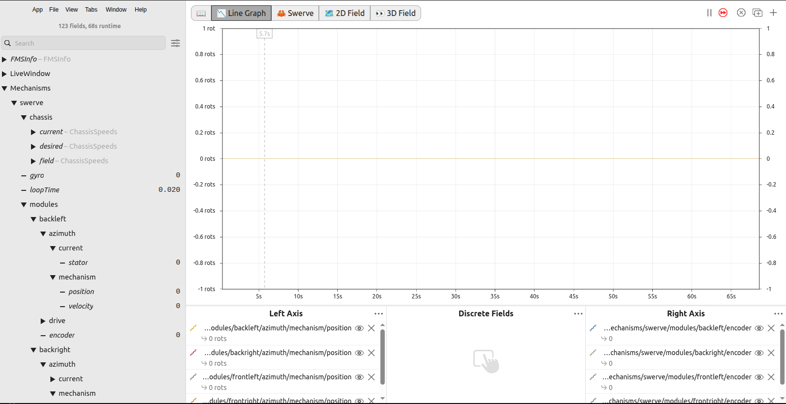

# Telemetry, Simulation & Vision

## Telemetry

YAMS pushes swerve drive and module data to NetworkTables under `Mechanisms/swerve` (the table name
is currently always `swerve`, regardless of your subsystem's name). This is the data most dashboards
(Shuffleboard, Elastic, AdvantageScope) read to render swerve widgets — see the
[AdvantageScope how-to guide](../how-to/set-up-advantagescope.md).

<figure><figcaption><p>The Mechanisms/swerve NetworkTables tree as seen in AdvantageScope.</p></figcaption></figure>

```
Mechanisms/swerve/
├── gyro                    (degrees)
├── loopTime                (seconds)
├── pose                    (Pose2d struct)
├── chassis/
│   ├── current             (ChassisSpeeds struct, robot-relative, measured)
│   ├── desired              (ChassisSpeeds struct, robot-relative, commanded)
│   └── field                (ChassisSpeeds struct, field-relative)
├── states/
│   ├── current              (SwerveModuleState[] struct array, measured)
│   └── desired               (SwerveModuleState[] struct array, commanded)
└── modules/<name>/
    ├── encoder              (degrees — the module's raw absolute encoder reading)
    ├── drive/                (that module's drive SmartMotorController telemetry)
    │   ├── current/stator
    │   └── mechanism/{position, velocity}
    └── azimuth/              (that module's angle/steering SmartMotorController telemetry)
        ├── current/stator
        └── mechanism/{position, velocity}
```


`modules/<name>/encoder` is the raw absolute encoder reading, in degrees — this is the value you
read to determine `absoluteEncoderOffset` for that module. It sits directly under the module's
table, as a sibling of `drive` and `azimuth`, not nested inside either of them.


How much gets published is controlled by `yams.motorcontrollers.SmartMotorControllerConfig.TelemetryVerbosity`:

```java
public enum TelemetryVerbosity {
  LOW,   // minimal telemetry
  MID,   // moderate telemetry
  HIGH   // full swerve drive + module data
}
```


This enum replaces the old `NONE`/`LOW`/`INFO`/`POSE`/`HIGH`/`MACHINE` levels from pre-2026 YAGSL. If you're migrating an older robot project, map your old verbosity choice down to the nearest of `LOW`/`MID`/`HIGH` — see [Schema Changes](../reference/schema-changes.md).


```java
var cfg = new SwerveDriveConfig()
    .withTelemetry(TelemetryVerbosity.HIGH);

drive = new SwerveParser(directory).createSwerveDrive(cfg);
```


Higher telemetry verbosity can induce some lag on the robot and slow down loop cycle times — be deliberate about what you choose, especially in competition.


### Reading module telemetry while bringing up a robot

The most useful pair of values while bringing up a new robot are `modules/<name>/encoder` (the raw
absolute encoder, in degrees) and `modules/<name>/azimuth/mechanism/position` (the angle motor's
own relative encoder, tracking the absolute encoder once seeded):

* If the absolute encoder decreases while the module is rotated counter-clockwise (should be CCW+),
  set `absoluteEncoderInverted` for that module.
* If the drive or angle motor's telemetry decreases when it should be increasing (or vice versa),
  invert that motor in `inverted.drive`/`inverted.angle`.

See [Determine Motor/Encoder Inversion](../how-to/determine-inversion.md) for the full procedure.

## Simulation

YAMS simulates the whole swerve drive using the same vendor simulation models as the real hardware, to varying degrees of fidelity per vendor. All you need to do is call `simIterate()` from your subsystem's `simulationPeriodic()`:

```java
@Override
public void simulationPeriodic()
{
  drive.simIterate();
}
```


[Cosine compensation](module-behaviors.md#cosine-compensation) is tuned for real hardware behavior and can look wrong in simulation — this is expected, not a bug in your config.


For more on WPILib's simulation framework generally:



## Vision Odometry

YAMS's `SwerveDrive` maintains a `SwerveDrivePoseEstimator` internally, and extends its vision-fusion API directly onto `SwerveDrive` so you don't need to construct or manage your own estimator:

```java
drive.addVisionMeasurement(visionPose, timestampSeconds);

// Or with per-measurement standard deviations:
drive.addVisionMeasurement(visionPose, timestampSeconds, visionStdDevs);

// Or set a persistent default:
drive.setVisionMeasurementStdDevs(visionStdDevs);
```

Feed this from your vision subsystem (PhotonVision, Limelight, etc.) every time a new pose estimate is available. Standard deviations control how much the pose estimator trusts a given vision measurement relative to odometry — tighter (smaller) values pull the estimate toward vision more aggressively; looser (larger) values let odometry dominate. Tune these empirically; see [Swerve Drive Drift Causes](../reference/swerve-drift-causes.md) if pose estimates drift or jump unexpectedly.
