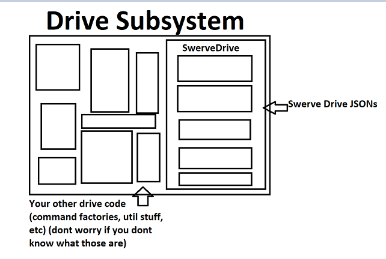

# What is YAGSL?

## Where does YAGSL fit into my program?

YAGSL used to be a full swerve drive implementation of its own. It no longer is. **YAGSL is now a thin JSON configuration parser that builds a [YAMS](https://yams.yamgen.com/) `SwerveDrive`.**

YAMS ([Yet Another Mechanism Suite](https://yams.yamgen.com/)) is a general-purpose FRC mechanism library — arms, elevators, flywheels, and swerve drives all share the same underlying `SmartMotorController` abstraction, feedforward/feedback plumbing, simulation support, and telemetry. YAMS's `yams.mechanisms.swerve.SwerveDrive` is a complete, hardware-agnostic swerve implementation in its own right; it does not need YAGSL to function.

What YAGSL adds on top is the part FRC teams actually re-do every season: turning a description of *your* robot's hardware (which motor controllers, which absolute encoders, which gyro, what gear ratios, where each module sits) into the Java objects YAMS needs — `SwerveDriveConfig`, `SwerveModuleConfig`, and `SmartMotorControllerConfig` — without you hand-writing that boilerplate for every robot.

<figure><figcaption><p>Diagram depicting a drive subsystem and where <code>SwerveDrive</code> fits into one. (created by DeltaDizzy)</p></figcaption></figure>

## How the pieces fit together

1. You describe your robot's hardware as JSON files (`swervedrive.json`, and per-module files under `modules/`) — generated for you by **[config.yagsl.com](https://config.yagsl.com)**, or hand-written if you prefer.
2. `swervelib.parser.SwerveParser` reads that JSON, resolves each device string (e.g. `sparkflex_neo`, `cancoder_can`) to the right vendor hardware wrapper, and builds a YAMS `SwerveModuleConfig`/`SmartMotorControllerConfig` per module.
3. `SwerveParser.createSwerveDrive(SwerveDriveConfig)` hands those configs to YAMS, which constructs and returns a ready-to-drive `yams.mechanisms.swerve.SwerveDrive`.
4. From there, everything — kinematics, odometry, telemetry, simulation, vision fusion, driver-input shaping via `SwerveInputStream` — is YAMS's API, documented in the [YAMS API reference](../reference/api-reference.md). YAGSL only exists at the boundary between "JSON describing my robot" and "a working `SwerveDrive` object."

```java
var cfg = new SwerveDriveConfig()
    .withStartingPose(new Pose2d(3, 3, Rotation2d.kZero))
    .withSubsystem(this)
    .withTelemetry(TelemetryVerbosity.HIGH);

drive = new SwerveParser(new File(Filesystem.getDeployDirectory(), "swerve/base"))
    .createSwerveDrive(cfg);
```


If you already know YAMS, or you outgrow what the JSON schema can express, you can always construct `SwerveDriveConfig`/`SwerveModuleConfig` yourself and skip `SwerveParser` entirely — it is a convenience layer, not a requirement.


## Our Philosophy

Your program does not revolve around your swerve drive. Your constants file doesn't have to take 10 minutes to find the right option. Different robots should be able to work with the same code — swap the `swerve/` config directory and the same subsystem code drives a different robot.

## Why do we exist?

Most swerve drive code out there is a template that teams are expected to modify and fit to their robot: not generic, and requiring a lot of time and effort to get working. Even after all that effort, bugs can hide in code you copied and never fully understood. There is a better way.

Do you have multiple robots and don't want to change any code to get them to work the same? Create a configuration directory, point `SwerveParser` at it, and go.

## Goals of this documentation

* Teach the fundamentals of a `SwerveDrive` and `SwerveModule` so you can debug and reason about your robot, even though YAMS builds the actual objects for you. See [Swerve Drive Kinematics](swerve-drive-kinematics.md) and [Swerve Modules](swerve-modules.md).
* Walk you through generating a configuration and bringing up your first YAGSL-driven robot — see the [Tutorial](../tutorial/README.md).
* Give you task-focused recipes for the debugging work every swerve team eventually needs — see the [How-to Guides](../how-to/how-to.md).
* Document the current JSON schema and hardware support precisely — see the [Reference](../reference/reference.md) section.
