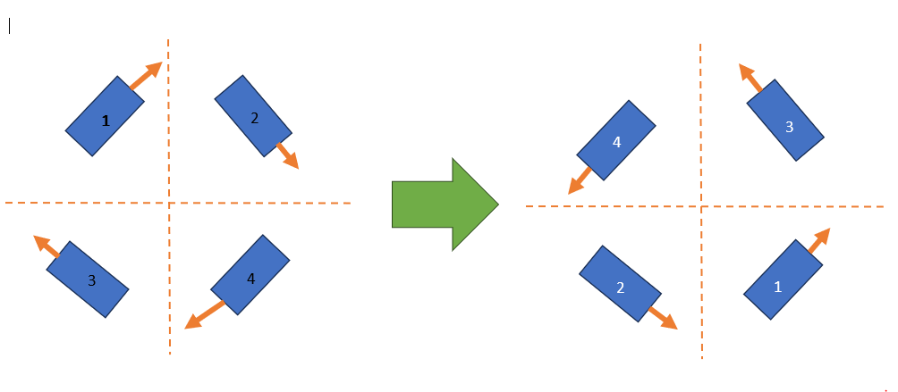

# How to debug the eight steps

## Something is wrong but it's driving-ish?

When changing inversion states doesn't work and nothing else you know of fixes the issue, debugging can be painful and arduous. Here are the eight steps that are unfortunately necessary to work through it.

Affectionately known as _"Translational Axis change based off of the robot heading"_ (the X and Y axis change in field-oriented control based on your robot turning), these steps will resolve it somewhere along the way.

## Prepare your robot code

To run these tests quickly and effectively, use the following (or a variation of it) as your drive code. You may need to port it to your joystick or negate axis data, but this will help you debug faster.


```java
SwerveDriveSubsystem drivebase;
CommandXboxController driverXbox;

// Applies deadbands and inverts controls because joysticks
// are back-right positive while robot controls are front-left positive.
// Left stick controls translation, right stick controls the desired
// heading directly (NOT angular rotation).
SwerveInputStream driveDirectAngle =
    new SwerveInputStream(drivebase.getSwerveDrive(),
                          () -> -driverXbox.getLeftY(),
                          () -> -driverXbox.getLeftX(),
                          () -> -driverXbox.getRightX(),
                          () -> -driverXbox.getRightY())
        .withAllianceRelativeControl();

drivebase.setDefaultCommand(drivebase.drive(driveDirectAngle));
```


This uses the four-argument `SwerveInputStream(drive, x, y, headingX, headingY)` constructor, which drives directly to a heading computed from the right stick instead of an angular velocity — the same "point the stick where you want the robot to face" behavior the old `SwerveController.getTargetSpeeds()` heading-hold path provided. If you're using the two-argument angular-velocity constructor instead, the steps below are identical; only the exact symptom description changes slightly.

## The eight steps


**The steps are dangerous!**

6 of them will cause your robot to spin out of control.

1 of them will be correct.

1 of them will appear to be correct but have the translational axis change based on the robot's heading.



You are not expected to complete all of these steps to get a functioning swerve drive — somewhere along the way your issue should disappear.


1. Start by setting `gyroInvert` in `swervedrive.json` to `false` **AND** `drive.inverted` to `false` in every module JSON.
2. THEN set `gyroInvert` to `true`.
3. THEN invert all of the drive motors in the module JSONs by setting `inverted.drive` to `true`.
4. THEN set `gyroInvert` back to `false`.
5.  THEN [flip the modules](#user-content-fn-1)[^1].\\

    <figure><figcaption><p>Depiction of flipping the modules correctly.</p></figcaption></figure>
6. THEN un-invert all of the drive motors (`inverted.drive` back to `false`).
7. THEN set `gyroInvert` to `true`.
8. THEN set your drive motors' `inverted.drive` back to `true`.


IF none of these work, you most likely have an incorrect hardware configuration, something is not working as expected, or something is wired incorrectly.


## Verifying behavior

Sometimes the eight steps don't look done when they really are. Here's an example where the robot is actually tuned correctly, but the desired front of the robot is really the back of the robot.

<details>

<summary>How to swap module configurations</summary>

For the examples, we label modules with numbers to reduce confusion; when changing module files around, we assign the numbers to the respective initial module configuration names. For the example above:

1. `frontleft.json`
2. `frontright.json`
3. `backleft.json`
4. `backright.json`

**Swapping `frontleft.json` with `backright.json`**

```json title="frontleft.json"
{
  "drive": { "type": "sparkmax_neo", "id": 4, "canbus": "" },
  "angle": { "type": "sparkmax_neo", "id": 3, "canbus": "" },
  "absoluteEncoder": { "type": "cancoder_can", "id": 9, "channel": 0, "canbus": "" },
  "inverted": { "drive": false, "angle": false },
  "absoluteEncoderOffset": -114.609,
  "location": { "front": 12, "left": 12 }
}
```

```json title="backright.json"
{
  "drive": { "type": "sparkmax_neo", "id": 5, "canbus": "" },
  "angle": { "type": "sparkmax_neo", "id": 6, "canbus": "" },
  "absoluteEncoder": { "type": "cancoder_can", "id": 11, "channel": 0, "canbus": "" },
  "inverted": { "drive": false, "angle": false },
  "absoluteEncoderOffset": -18.281,
  "location": { "front": -12, "left": -12 }
}
```

Swap the device IDs and offsets between the two files (keep each file's own `location`) and you've swapped the module configurations correctly.

#### The easy way

1. Change the `location` negations to the desired module side.
2. Rename the files without overwriting each other.

</details>

[^1]: Change the device configuration for the drive AND angle motor controllers AND the absolute encoders in the following way:

    (Front Left -> Back Right)
    (Front Right -> Back Left)
    (Back Left -> Front Right)
    (Back Right -> Front Left)
