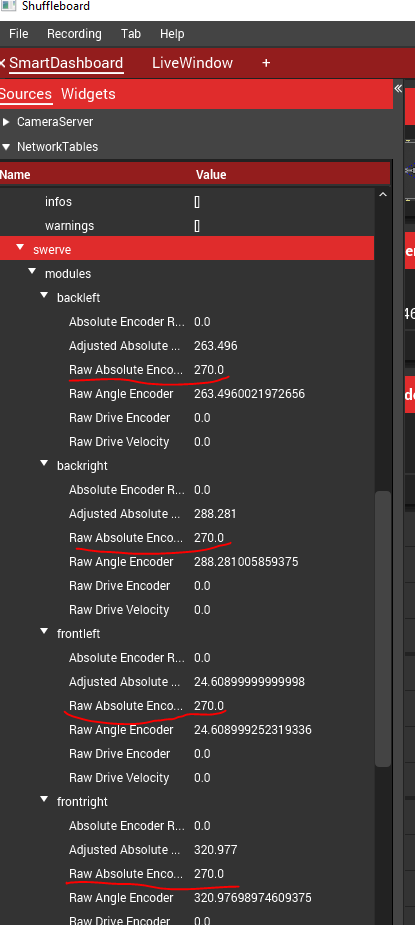
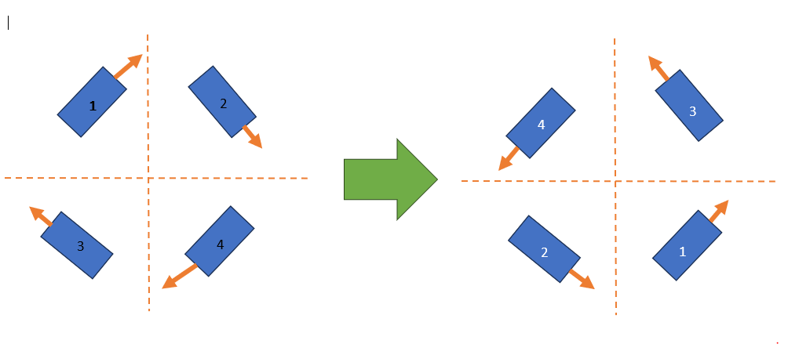

# How to determine inversion

Swerve modules and swerve drives require some inversions to get working properly. The goal is to get everything to increase **counter-clockwise positive (CCW+)**.


If your gears are grinding on the ground but not while on blocks, and your wheels are facing and spinning in the right directions, you may need to [tune PID](tune-pidf-gains.md) instead of inverting anything!



If you invert incorrectly, your modules or robot may spin "out of control." If nothing here resolves it, see [debugging the eight steps](debug-the-eight-steps.md).


## Swerve motors

When you spin your motor counterclockwise, the value in NetworkTables `swerve/modules/.../Raw Absolute Encoder` and `swerve/modules/.../Raw Angle Encoder` should both increase.

* 
* Take note of the `swerve/modules/.../Raw Absolute Encoder` values and use them for `absoluteEncoderOffset` in the module JSONs (or paste them into **[config.yagsl.com](https://config.yagsl.com)**).

## Spin your module counterclockwise


Spin your modules **COUNTERclockwise** from the top-down view.


<figure><figcaption><p>Purple shows the way your bevels should be facing (photo by Team 2876)</p></figcaption></figure>

The swerve drive should be on its side or otherwise lifted. Your swerve module bevels must be facing left, as shown. To rotate the swerve modules, rotate them counterclockwise as shown.

### If `swerve/modules/.../Raw Angle Encoder` is decreasing...

Invert the angle motor for every module that is decreasing, in that module's JSON file:

```json
{
  "drive": { "type": "sparkmax_neo", "id": 2, "canbus": "" },
  "angle": { "type": "sparkmax_neo", "id": 1, "canbus": "" },
  "absoluteEncoder": { "type": "cancoder_can", "id": 10, "channel": 0, "canbus": "" },
  "inverted": {
    "drive": false,
    "angle": true
  },
  "absoluteEncoderInverted": false,
  "absoluteEncoderOffset": -50.977,
  "location": { "front": 12, "left": -12 }
}
```

### If `swerve/modules/.../Raw Absolute Encoder` is decreasing...

Invert the absolute encoder in the module JSON with `absoluteEncoderInverted`:

```json
{
  "drive": { "type": "sparkmax_neo", "id": 2, "canbus": "" },
  "angle": { "type": "sparkmax_neo", "id": 1, "canbus": "" },
  "absoluteEncoder": { "type": "cancoder_can", "id": 10, "channel": 0, "canbus": "" },
  "inverted": {
    "drive": false,
    "angle": false
  },
  "absoluteEncoderInverted": true,
  "absoluteEncoderOffset": -50.977,
  "location": { "front": 12, "left": -12 }
}
```

## Spin your wheel counterclockwise


You may need to invert these if rotating the robot changes its perceived front/back while driving in field-oriented mode.



#### Odometry mismatch

If your robot drives backwards in odometry but forwards in real life, while a spin-in-place still shows Counter-Clockwise-Positive movement, apply this patch: add `180` to every `absoluteEncoderOffset` in every module file.


### If `swerve/modules/.../Raw Drive Encoder` is decreasing...

Invert the drive motor for every module that is decreasing:

```json
{
  "drive": { "type": "sparkmax_neo", "id": 2, "canbus": "" },
  "angle": { "type": "sparkmax_neo", "id": 1, "canbus": "" },
  "absoluteEncoder": { "type": "cancoder_can", "id": 10, "channel": 0, "canbus": "" },
  "inverted": {
    "drive": true,
    "angle": false
  },
  "absoluteEncoderInverted": false,
  "absoluteEncoderOffset": -50.977,
  "location": { "front": 12, "left": -12 }
}
```

## Rotate your robot counterclockwise


Your robot spinning counterclockwise should look like the diagram above when the wheels are powered! You **WILL** need to change your CAN IDs for each module file if it doesn't match.


<figure><figcaption><p>IDs relocated in swerve module files</p></figcaption></figure>

You should notice the `Raw Gyro Yaw` field in your driver dashboard increase as the robot turns CCW. If it doesn't, invert the gyro in `swervedrive.json`:

```json
{
  "gyro": {
    "type": "pigeon2_can",
    "id": 13,
    "canbus": "canivore"
  },
  "gyroAxis": "yaw",
  "gyroInvert": true,
  "modules": [
    "frontleft",
    "frontright",
    "backleft",
    "backright"
  ]
}
```

See the [gyroscope reference](../reference/hardware/gyroscopes.md) for the full list of supported `gyro.type` values.


In older YAGSL configs (pre-2026.8.05) this section was named `imu`/`invertedIMU` instead of `gyro`/`gyroInvert` — see the [schema changes reference](../reference/schema-changes.md) if you're working from an old config.

