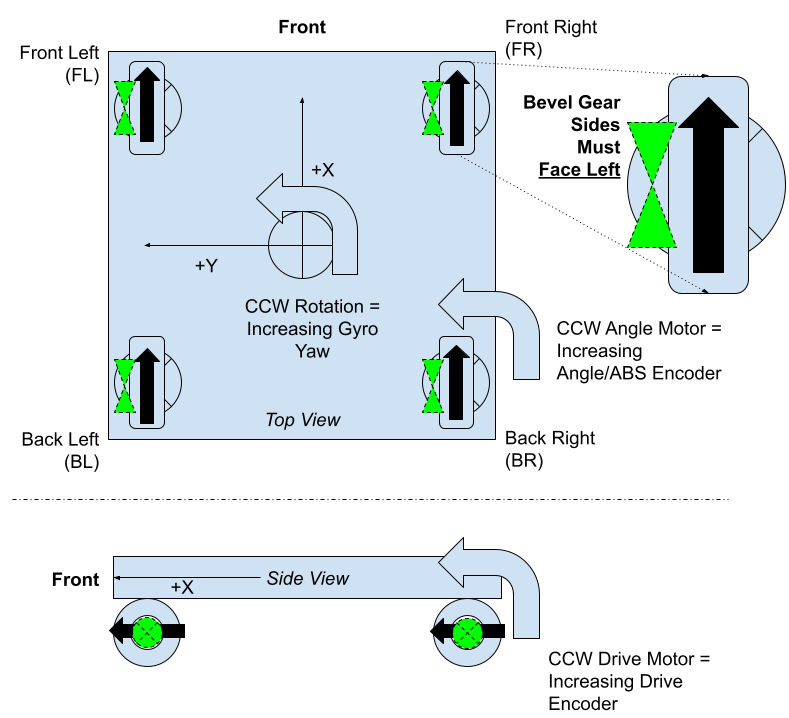

# How to determine inversion

Swerve modules and swerve drives require some inversions to get working properly. The goal is to get everything to increase **counter-clockwise positive (CCW+)**.


[config.yagsl.com/guide](https://config.yagsl.com/guide) walks through this exact process
interactively, with animations, if you'd rather follow along there instead of on this page.



If your gears are grinding on the ground but not while on blocks, and your wheels are facing and spinning in the right directions, you may need to [tune PID](tune-pidf-gains.md) instead of inverting anything!



If you invert incorrectly, your modules or robot may spin "out of control." If nothing here resolves it, see [debugging the eight steps](debug-the-eight-steps.md).


All of the telemetry referenced below lives under `Mechanisms/swerve` in NetworkTables — see
[Telemetry, Simulation & Vision](../explanation/telemetry-and-vision.md) for the full tree.

## 1. Confirm the absolute encoder reads CCW+

<figure><figcaption><p>Purple shows the way your bevels should be facing (photo by Team 2876)</p></figcaption></figure>

With the robot lifted or on its side so the wheels spin freely, rotate one module by hand
**counterclockwise** (viewed from directly above, robot front pointing away from you) and watch
that module's `modules/<name>/encoder` value in AdvantageScope.

* If it **increases**, the absolute encoder is already correct — leave `absoluteEncoderInverted` as
  `false`.
* If it **decreases**, set `absoluteEncoderInverted` to `true` for that module. This is rare — most
  absolute encoders already read CCW+ by default.

```json
{
  "drive": { "type": "sparkmax_neo", "id": 2, "canbus": "" },
  "angle": { "type": "sparkmax_neo", "id": 1, "canbus": "" },
  "absoluteEncoder": { "type": "cancoder_can", "id": 10, "channel": 0, "canbus": "" },
  "inverted": { "drive": false, "angle": false },
  "absoluteEncoderInverted": true,
  "absoluteEncoderOffset": -50.977,
  "location": { "front": 12, "left": -12 }
}
```

Once every module reads CCW+, rotate each wheel to point straight forward (bevel gear left) and
record the `modules/<name>/encoder` value held in that position — that's the module's
`absoluteEncoderOffset`. Enter it in the module's JSON, or paste it into
**[config.yagsl.com](https://config.yagsl.com)**.

## 2. Confirm the gyro reads CCW+

With the robot lifted off the ground, rotate the **entire robot** counterclockwise (viewed from
above) and watch `Mechanisms/swerve/gyro`.

* If it **increases**, leave `gyroInvert` alone — there's nothing to change.
* If it **decreases**, set `gyroInvert` to `true` in `swervedrive.json`:

```json
{
  "gyro": { "type": "pigeon2_can", "id": 13, "canbus": "canivore" },
  "gyroAxis": "yaw",
  "gyroInvert": true,
  "modules": ["frontleft.json", "frontright.json", "backleft.json", "backright.json"]
}
```

See the [gyroscope reference](../reference/hardware/gyroscopes.md) for the full list of supported `gyro.type` values.

## 3. Spin test — catch drive motor inversion and module swaps

Still with the robot lifted off the ground, deploy code and drive with a joystick input that
commands pure rotation (e.g. hold the rotation stick fully to one side). Watch the robot against
AdvantageScope's Swerve widget (top-down view) — see
[Set up AdvantageScope](set-up-advantagescope.md) — and compare:

| Symptom                                                              | Likely cause                                                                                                    |
| ----------------------------------------------------------------------- | -------------------------------------------------------------------------------------------------------------------- |
| Modules drift or translate instead of spinning cleanly in place          | Wrong CAN IDs for a module, or a wrong `absoluteEncoderOffset`.                                                    |
| Spins cleanly, but the wrong way (clockwise instead of CCW)               | Inverted drive motor(s); a diagonal module swap (front-left ↔ back-right, front-right ↔ back-left); or an absolute encoder offset captured with the bevel gear facing right instead of left. |

If a single module is spinning the wrong way, invert that module's drive motor:

```json
{
  "drive": { "type": "sparkmax_neo", "id": 2, "canbus": "" },
  "angle": { "type": "sparkmax_neo", "id": 1, "canbus": "" },
  "absoluteEncoder": { "type": "cancoder_can", "id": 10, "channel": 0, "canbus": "" },
  "inverted": { "drive": true, "angle": false },
  "absoluteEncoderInverted": false,
  "absoluteEncoderOffset": -50.977,
  "location": { "front": 12, "left": -12 }
}
```

If every module spins the wrong way at once, double-check for a diagonal module swap in
`swervedrive.json`'s `modules` list before you start flipping individual `inverted.drive` fields —
it's a more common cause than it sounds.

## 4. Field-orientation check

Once the spin test looks right, put the robot down and drive it forward/back/left/right at its
starting heading while watching a 2D/3D Field tab fed from `Mechanisms/swerve/pose`. Then spin in
place again, this time watching the field widget's heading instead of the swerve module widget.

* **Wrong at every heading, including the start:** check `gyroInvert`.
* **Only wrong once you rotate away from the starting heading:** an absolute encoder offset that's
  off, a drive motor inversion mistake, a wrong module `location`, an absolute encoder wired to the
  wrong motor controller, or a wrong CAN ID. Verify wiring and CAN IDs first — they're the fastest
  to rule out.
* **The spin test in step 3 looked right, but the field widget's heading spins backwards:** an
  inverted gyro can flip the field widget even when the module states widget looked correct.


#### Odometry mismatch

If your robot drives backwards in odometry but forwards in real life, while a spin-in-place still shows Counter-Clockwise-Positive movement, apply this patch: add `180` to every `absoluteEncoderOffset` in every module file.



In older YAGSL configs (pre-2026.8.05) this section was named `imu`/`invertedIMU` instead of `gyro`/`gyroInvert` — see the [schema changes reference](../reference/schema-changes.md) if you're working from an old config.

