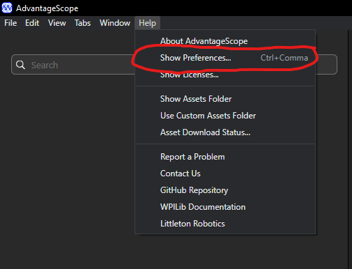
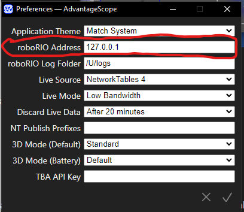
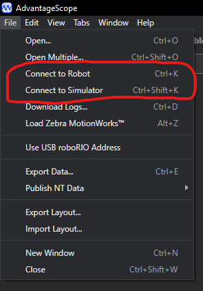
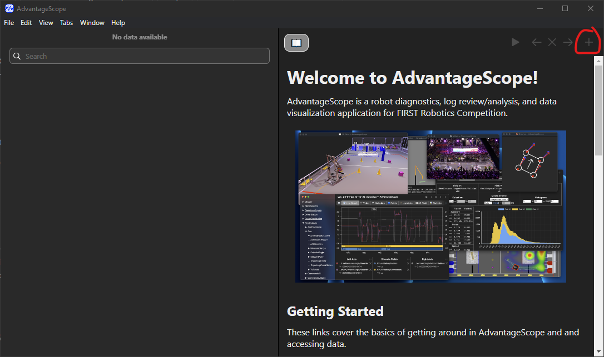
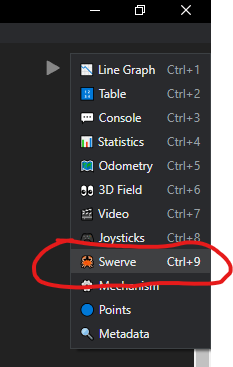
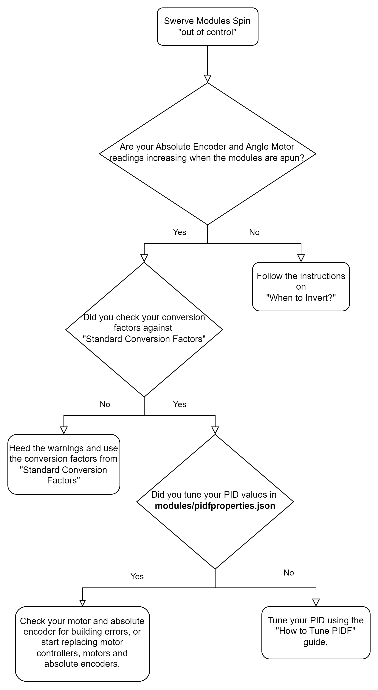

# How to set up AdvantageScope

## Opening

Since the 2024 season, [AdvantageScope](https://github.com/Mechanical-Advantage/AdvantageScope) has been included with the WPILib installation. There is no external download required, but with every WPILib update you should re-download the [WPILib installer](https://docs.wpilib.org/en/stable/docs/zero-to-robot/step-2/wpilib-setup.html) to get the latest version of WPILib tools.

## Configuring AdvantageScope

1. Connect your laptop to the robot.
2. Open `AdvantageScope (WPILib)`, or in VS Code open the command palette and type `WPILib: Start Tool`, then click `AdvantageScope`.
3. Click `Help`, then `Show Preferences`.

<figure><figcaption>
AdvantageScope's help menu
</figcaption></figure>

4. Input the roboRIO IP address based on your team number: `10.TE.AM.2`.

<figure><figcaption>
roboRIO Address field highlighted
</figcaption></figure>

5. Connect to the robot (or the simulator).

<figure><figcaption>
Connect to Robot menu
</figcaption></figure>

6. Add a new tab by clicking the `+` on the right side of the window.

<figure><figcaption>
Add new tab
</figcaption></figure>

7. Add a new 🦀 Swerve tab.

<figure><figcaption>
Swerve tab
</figcaption></figure>

8. Connect the module states and rotation from SmartDashboard to the fields.
   1. Under the `SmartDashboard/swerve` menu, drag everything from `advantagescope/` into the `Sources` field.
   2. You may need to enable your robot before you can add `SmartDashboard/swerve/advantagescope/desiredStates`.

<figure><figcaption></figcaption></figure>

9. Adjust the Data column to match your swerve drive's properties.
   1. Under the `Data` column, set `Max Speed` to the value of the `SmartDashboard/swerve/maxSpeed` entry.

<figure><figcaption></figcaption></figure>

10. (Optional) Adjust the Display column to accurately reflect your robot's chassis dimensions by matching `Size (Left-Right)` and `Size (Front-Back)` to `SmartDashboard/swerve/sizeLeftRight` and `SmartDashboard/swerve/sizeFrontBack`.

<figure><figcaption></figcaption></figure>

## Reading the display


The **RED** lines are the measured velocity and position of each swerve module.

The **BLUE** lines are the velocity and position each module was commanded to.


Large, persistent gaps between the red and blue lines usually point to a tuning issue — see [how to tune PIDF gains](tune-pidf-gains.md) and [how to diagnose swerve drive drift](diagnose-swerve-drift.md).
