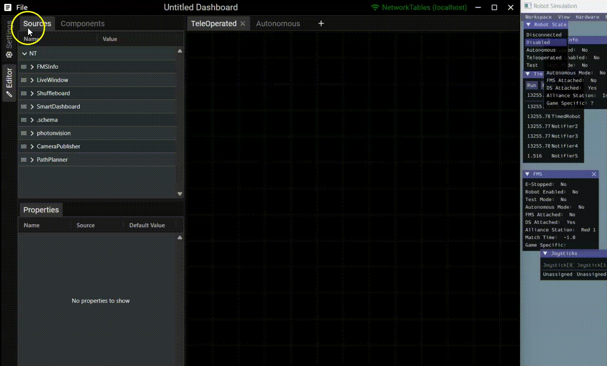
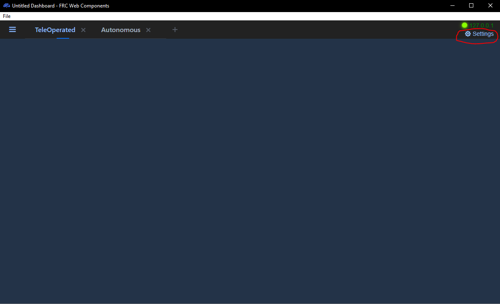
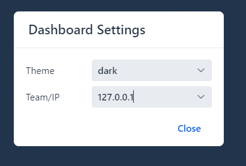
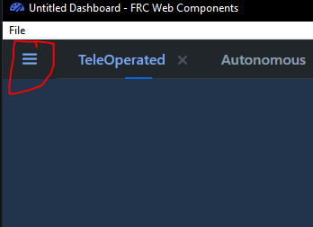
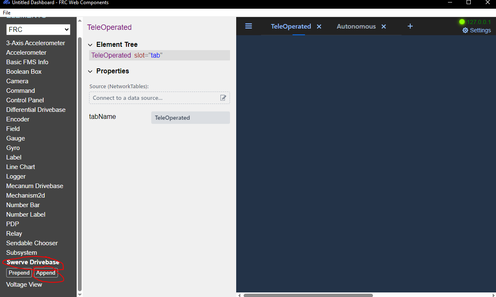
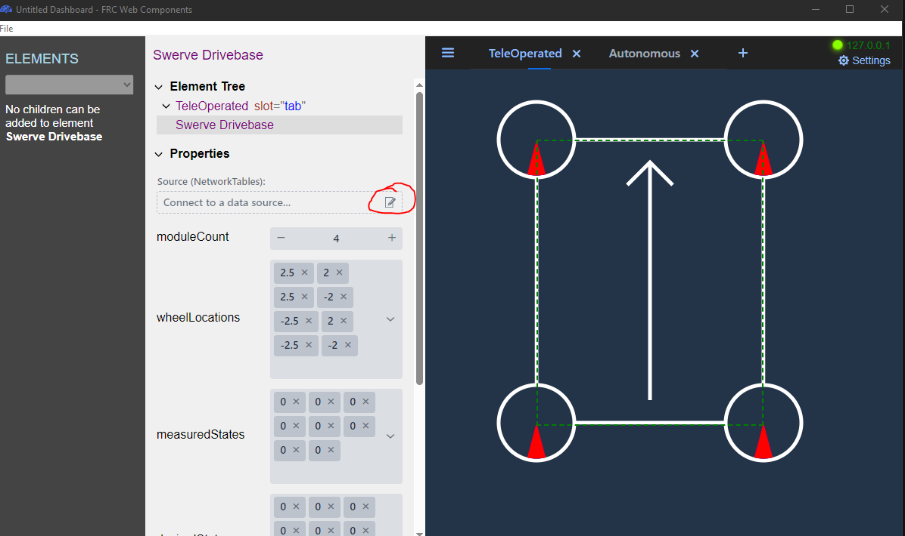
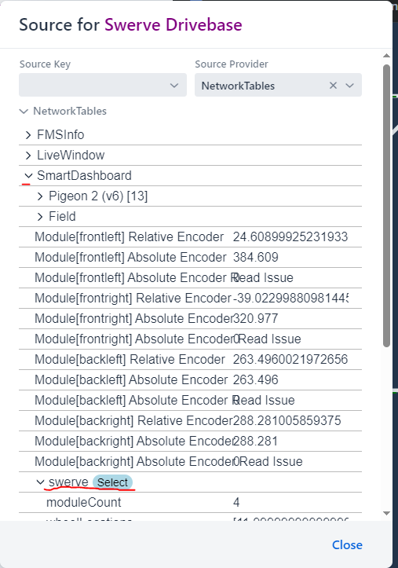
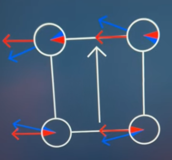

# How to set up FRC Web Components

FRC Web Components is an easy way to visualize the swerve drive and give helpful feedback when debugging.

## Download

Download and install it from the releases page:



## Configuring FRC Web Components

<figure><figcaption></figcaption></figure>

1. Connect your laptop to the robot.
2. Open "FRC Web Components".
3. Click "Settings".

<figure><figcaption>
FRC Web Components with Settings highlighted
</figcaption></figure>

4. Input the roboRIO IP address based on your team number: `10.TE.AM.2`.



<figure><figcaption>
Dashboard settings for FRC Web Components.
</figcaption></figure>

5. Open the widget menu.

<figure><figcaption>
Press here.
</figcaption></figure>

6. Select `Swerve Drivebase` and click `Append`.

<figure><figcaption></figcaption></figure>

7. Click on the widget.
8. Click "Connect to data source...".

<figure><figcaption></figcaption></figure>

9. Connect to `SmartDashboard/swerve` by selecting it here.

<figure><figcaption></figcaption></figure>

10. Press "Close".

## Reading the display

<figure><figcaption>
Swerve drivebase while in motion with an incorrect configuration.
</figcaption></figure>


The **BLUE** lines are the measured velocity and position of each swerve module.

The **RED** lines are the velocity and position each module was commanded to.


Large, persistent gaps between the red and blue lines usually point to a tuning issue — see [how to tune PIDF gains](tune-pidf-gains.md) and [how to diagnose swerve drive drift](diagnose-swerve-drift.md).
