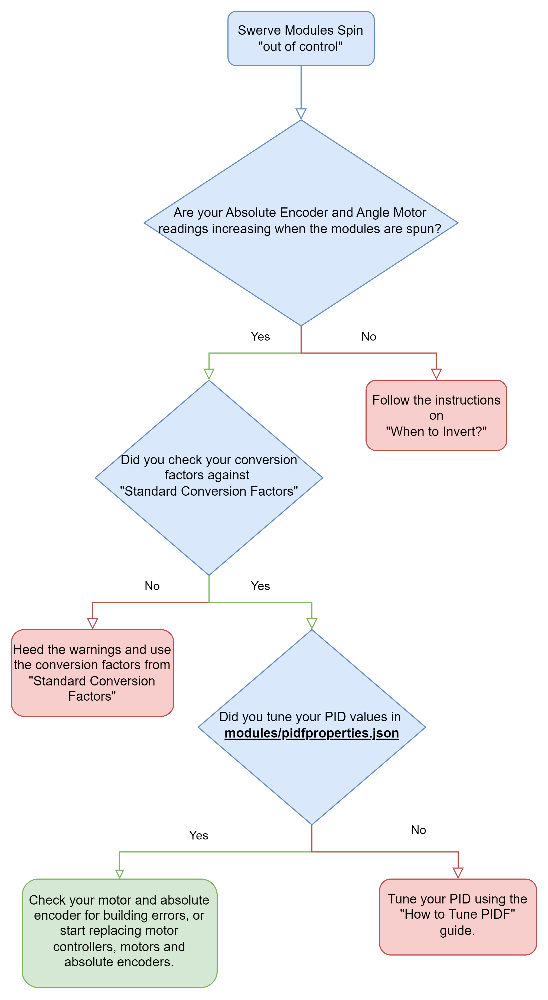
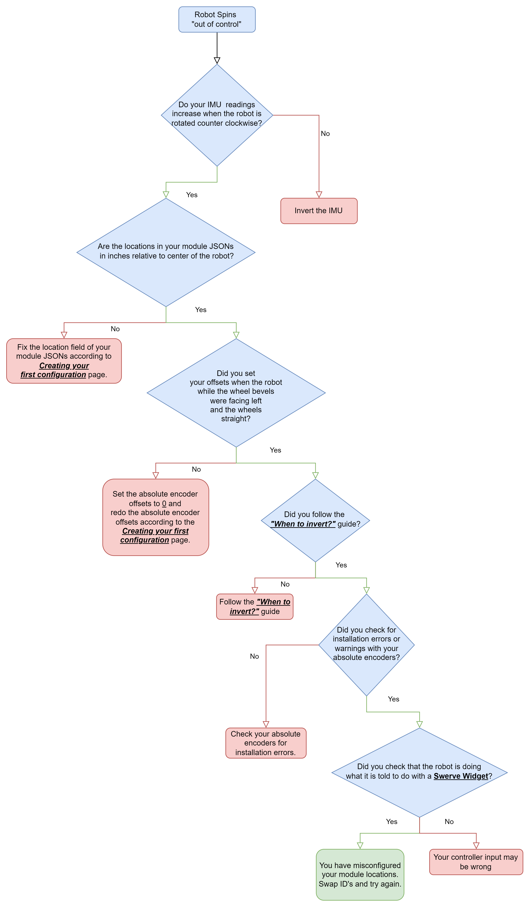

# Troubleshooting flowchart

## Swerve drive diagram

<figure><figcaption></figcaption></figure>


Older gyroscopes like the Pigeon 1 and NavX 1 drift the longer they're powered on. Consider rebooting or zeroing your gyroscope at the start of your program.


## Swerve modules spinning "out of control"

<figure><figcaption></figcaption></figure>

## Swerve module does not spin correctly

1. Are the CAN IDs, motor types, and absolute encoder types correct? See the [device reference](../reference/hardware/) for supported type strings.
2. Are the module `location`s correct?
3. Do you use an absolute magnetic encoder?
   1. Did you loctite the magnet in?
   2. Do you have a good (usually green LED) reading on the magnet?
4. Did you set `absoluteEncoderOffset` while the wheels had the bevel facing left and the wheel pointed straight front-to-back?
5. Did you check [how to determine inversion](determine-inversion.md) for inversion states?
6. Did you [tune your PID](tune-pidf-gains.md)?

If none of the above resolves it, move on to [debugging the eight steps](debug-the-eight-steps.md).

## Swerve drive "spins out of control"

<figure><figcaption></figcaption></figure>

See [how to determine inversion](determine-inversion.md) and [how to debug the eight steps](debug-the-eight-steps.md).
