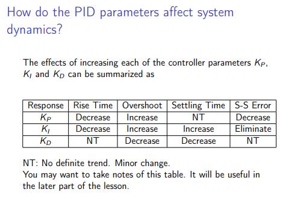

# How to tune PIDF gains


Swerve steering/angle/azimuth motors have PID wrapping enabled at the topmost and bottommost point (e.g. "front" and "back"). When tuning angle PID you may want to test with left or right translation so the module doesn't cross the wrap point.


## The basic idea

YAGSL reads PIDF values from [`pidfproperties.json`](../reference/json-schema/pidfproperties-json.md) in your module folder — generate or edit it with **[config.yagsl.com](https://config.yagsl.com)**.

This has been hashed and boiled down to the simplest form like this before:

* **P**: if you're not where you want to be, get there.
* **I**: if you haven't been where you want to be for a long time, get there faster.
* **D**: if you're getting close to where you want to be, slow down.
  * [Video](https://www.youtube.com/watch?v=qKy98Cbcltw) found by 78, found by [this CD post](https://www.chiefdelphi.com/t/finally-i-understand-pid/450811)

<figure><figcaption></figcaption></figure>

## Tuning procedure

Another good way to describe it, [from CTRE](https://pro.docs.ctr-electronics.com/en/latest/docs/api-reference/device-specific/talonfx/closed-loop-requests.html):

Manual tuning typically follows this process:

1. Set $$P$$, $$I$$, and $$D$$ to zero.
2. Increase $$P$$ until the output **starts** to **oscillate** **around** the setpoint.
3. Increase $$D$$ as much as possible **without** introducing **jittering** to the response.

For the drive motor, also set the feedforward terms (`s`, `v`, `a` — see below) before fine-tuning `P`; a good feedforward means `P` only has to correct small errors.

## WPILib walkthrough

WPILib has lots of great documentation on PID, so it's worth reading directly:


Basics of PID



Tuning velocity, like the drive motors!



Tuning position, like the steering/angle/azimuth motors!


## The current `pidfproperties.json` shape


The schema changed in YAGSL 2026.8.05 — `f` and `iz` (integral zone) and the old `output` clamp are gone. Feedforward is now expressed as `s`/`v`/`a` (`kS`/`kV`/`kA`, matching WPILib's `SimpleMotorFeedforward`). See the [schema changes reference](../reference/schema-changes.md) if you're migrating an older config by hand.


```json
{
  "drive": {
    "p": 0.02,
    "i": 0,
    "d": 0,
    "s": 0,
    "v": 0,
    "a": 0
  },
  "angle": {
    "p": 0.01,
    "i": 0,
    "d": 0,
    "s": 0,
    "v": 0,
    "a": 0
  }
}
```

If you leave drive `v` (kV) at `0`, YAGSL auto-derives it from the drive motor's free speed and your gearing, so a reasonable feedforward exists even before you've tuned anything by hand.

You can also add a `pidfproperties_sim.json` alongside it — YAGSL will load that one instead when running in simulation (`RobotBase.isSimulation()`), so you can use looser gains in sim without touching your competition robot's config.

## Starting points

The right PIDF values vary per-robot, but these are reasonable starting points to iterate from, organized by motor controller type.



```json
{
  "drive": {
    "p": 0.0020645,
    "i": 0,
    "d": 0,
    "s": 0,
    "v": 0,
    "a": 0
  },
  "angle": {
    "p": 0.01,
    "i": 0,
    "d": 0,
    "s": 0,
    "v": 0,
    "a": 0
  }
}
```



When the drive motor `type` for every module is `talonfx_*` (or alike — `krakenx60`, `falcon500`) this is a reasonable starting point:

```json
{
  "drive": {
    "p": 1,
    "i": 0,
    "d": 0,
    "s": 0,
    "v": 0,
    "a": 0
  },
  "angle": {
    "p": 50,
    "i": 0,
    "d": 0.32,
    "s": 0,
    "v": 0,
    "a": 0
  }
}
```



Once you have a reasonable starting point, use **[config.yagsl.com](https://config.yagsl.com)** to regenerate `pidfproperties.json` with your updated numbers, or hand-edit the file directly — both work, since the parser only cares about the final JSON.
