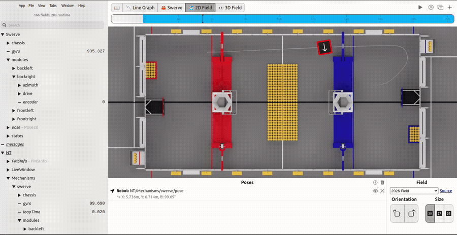
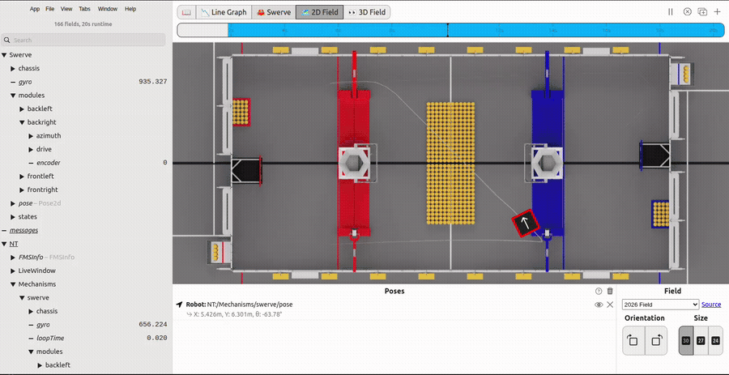
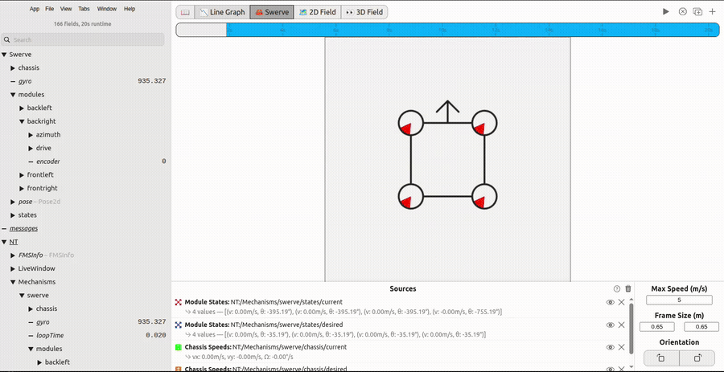

# View your DataLog in AdvantageScope


**This is not "Log Replay."** [AdvantageKit's Log Replay](https://docs.advantagekit.org/getting-started/what-is-advantagekit) re-runs your robot code against a recorded log to deterministically reproduce a match in simulation, and requires the AdvantageKit IO-interface pattern. What this page covers is simpler and works with **every** YAGSL robot, AdvantageKit or not: opening the `.wpilog` file your robot already wrote and looking at the recorded values in AdvantageScope. Nothing re-executes — you're just viewing a file.


Every field `SwerveParser` publishes to NetworkTables is also written to a WPILib `DataLog` automatically — no JSON field or code needed to opt in. See [Telemetry, Simulation & Vision](../explanation/telemetry-and-vision.md) for the live NetworkTables tree; this page is the practical walkthrough for looking at a _recorded_ run afterward.

## Step 1: Make sure a DataLog is actually being written

`DataLogManager` owns the actual file on disk. Start it once, early, in `Robot.java`:

```java
@Override
public void robotInit() {
  DataLogManager.start();
  DriverStation.startDataLog(DataLogManager.getLog()); // optional: also logs joystick/DS data
}
```


If you never call `DataLogManager.start()` yourself, it still starts lazily the first time `SwerveParser` publishes a field — but calling it explicitly in `robotInit()` guarantees the log begins at power-on (not at the first telemetry update) and lets you fold in DS/joystick data with `DriverStation.startDataLog(...)`.


On the real robot, `.wpilog` files are written to a USB drive if one is plugged in, otherwise to `/home/lvuser/logs` on the roboRIO's internal storage. In simulation, they land in your project's `logs/` folder next to `build.gradle`. WPILib initially names the file `FRC_TBD_<random>.wpilog` and renames it to a timestamp (e.g. `FRC_20260817_010558.wpilog`) once it has a real time source.

## Step 2: Nothing to configure — YAGSL logs automatically

Unlike hand-building a `SwerveDriveConfig`/`SwerveModuleConfig` yourself, `SwerveParser` already wires up a `DataLog` name for the drive and every module, at every level, for you:

* `Swerve` — the drive itself (pose, gyro, chassis speeds, module states).
* `Swerve/modules/<name>` — that module's absolute encoder.
* `Swerve/modules/<name>/drive` — that module's drive motor.
* `Swerve/modules/<name>/azimuth` — that module's angle/steering motor.


Note the DataLog tree uses a top-level `Swerve` (capitalized, no `Mechanisms` prefix) — a _different_ root than the live NetworkTables tree covered in [Telemetry, Simulation & Vision](../explanation/telemetry-and-vision.md) (`Mechanisms/swerve`, lowercase). Both describe the same data; AdvantageScope shows them as two separate branches in the field tree (`Swerve` for the DataLog-only entries, `NT` for the live/mirrored NetworkTables ones) — see the sidebar in the screenshots below.


There's no granular per-field opt-in and no way to disable this — if you're using `SwerveParser`, you already have a full DataLog recording of your swerve drive every time you run the robot.

## Step 3: Run it and record

Deploy or simulate the robot, enable it, and drive around for a bit — every field above writes to both NetworkTables and the DataLog continuously while enabled.

## Step 4: Pull the file and open it in AdvantageScope

1. Grab the `.wpilog` off the RIO (USB drive, or `scp lvuser@10.TE.AM.2:/home/lvuser/logs/*.wpilog .`) — or straight from your sim project's `logs/` folder.
2. Open **AdvantageScope**, then **File → Open File...** (or drag the `.wpilog` onto the window). Do **not** use "Connect to Robot/Simulator" — that connects live over NetworkTables, which shows _current_ values, not the recorded run.

## Step 5: Explore the data

Add a tab to visualize the data:

* **2D Field** tab — drag `Swerve/pose` in to see the robot's recorded path.

<figure><figcaption><p>Scrubbing a recorded run's path on the 2D Field tab, fed from Swerve/pose.</p></figcaption></figure>

* **Swerve** tab — AdvantageScope's built-in module visualizer. Drag `Swerve/states/current` (and optionally `Swerve/states/desired` and `Swerve/chassis/current`/`desired`) into the **Sources** list to see wheel vectors animate over the timeline.

<figure><figcaption><p>The Swerve tab replaying recorded module states — translating, then spinning in place.</p></figcaption></figure>

* **Line Graph** tab — drag any numeric field to plot it over time. A useful pairing while debugging: each module's `Swerve/modules/<name>/azimuth/mechanism/position` (the angle motor's own relative encoder, from the DataLog) against `Mechanisms/swerve/modules/<name>/encoder` (the raw absolute encoder, from the live NT mirror also present in the file) — if the two drift apart over a run, the relative encoder seeded from the wrong absolute offset.

<figure><figcaption><p>Dragging each module's azimuth position and absolute encoder fields into the Line Graph tab.</p></figcaption></figure>

Scrub the timeline at the top of the window to step through the run, or hit play to watch it back at normal speed.


Because this is just a file, you can open the same `.wpilog` in as many tabs/windows as you want, compare two different matches side by side, or hand the file to a teammate to look at independently — none of that requires the robot, the simulator, or AdvantageKit replay to be running.


## Related pages

* [Telemetry, Simulation & Vision](../explanation/telemetry-and-vision.md)
* [How to set up AdvantageScope](set-up-advantagescope.md)
* [Schema Changes](../reference/schema-changes.md)
