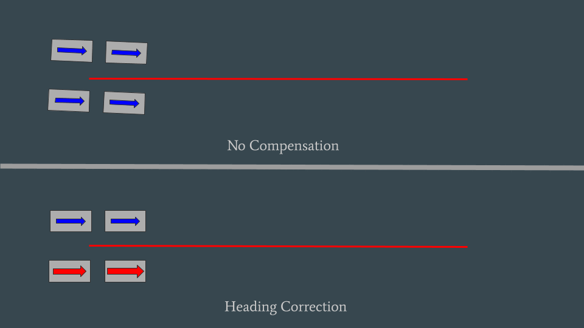

# Heading Correction

## What is Heading Correction?

Heading correction ensures your robot maintains its intended direction even as it moves sideways or diagonally. This feature is crucial for precise maneuvers and maintaining alignment during complex movements. It is aggressive and will prevent angular rotation based control schemes from working.

Heading correction was added to YAGSL by Team 1466 and improved upon by 7525 Pioneers and BoiledBurntBagel of 6036.

Below is a rough example of heading correction in action. Keep in mind this is not representing the modules position but the Robots Heading. This will give you a good idea of possible solution if your robot is struggling to maintain it's heading during matches or you are experiencing module drift.

<figure><figcaption><p>Heading Correction may not be needed!</p></figcaption></figure>

## How do I enable it?

You can enable or disable heading correction using [`SwerveDrive.setHeadingCorrection`](https://broncbotz3481.github.io/YAGSL/swervelib/SwerveDrive.html#setHeadingCorrection\(boolean\)) from anywhere. The deadband is an arbitrary value that represents both meters persecond and radians epr second.

## What does heading correction do in code?

Heading correction is used in [`SwerveDrive.drive`](https://broncbotz3481.github.io/YAGSL/swervelib/SwerveDrive.html#drive\(edu.wpi.first.math.kinematics.ChassisSpeeds,boolean,edu.wpi.first.math.geometry.Translation2d\)) to control the heading via the deadband [`SwerveDrive.setHeadingCorrection`](https://broncbotz3481.github.io/YAGSL/swervelib/SwerveDrive.html#setHeadingCorrection\(boolean,double\)). Heading correction uses the heading PID from `controllerproperties.json` and the current yaw to calculate an omega turning speed using [`SwerveController.headingCalculate`](https://broncbotz3481.github.io/YAGSL/swervelib/SwerveController.html#headingCalculate\(double,double\)).

```java
    // Heading Angular Velocity Deadband, might make a configuration option later.
    // Originally made by Team 1466 Webb Robotics.
    // Modified by Team 7525 Pioneers and BoiledBurntBagel of 6036
    if (headingCorrection)
    {
      if (Math.abs(velocity.omegaRadiansPerSecond) < HEADING_CORRECTION_DEADBAND
          && (Math.abs(velocity.vxMetersPerSecond) > HEADING_CORRECTION_DEADBAND
              || Math.abs(velocity.vyMetersPerSecond) > HEADING_CORRECTION_DEADBAND))
      {
        if (!correctionEnabled)
        {
          lastHeadingRadians = getYaw().getRadians();
          correctionEnabled = true;
        }
        velocity.omegaRadiansPerSecond =
            swerveController.headingCalculate(lastHeadingRadians, getYaw().getRadians());
      } else
      {
        correctionEnabled = false;
      }
    }
```
