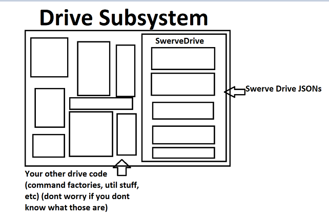

# What we do

## Where does YAGSL fit into my program?

YAGSL essentially boils down to one class [`SwerveDrive`](https://broncbotz3481.github.io/YAGSL/swervelib/SwerveDrive.html) which aims to act like [`DifferentialDrive`](https://github.wpilib.org/allwpilib/docs/release/java/edu/wpi/first/wpilibj/drive/DifferentialDrive.html) from [WPILib](https://docs.wpilib.org/en/stable/docs/software/hardware-apis/motors/wpi-drive-classes.html) except for Swerve Drives.

<figure><figcaption>
Diagram Depicting a Drive Subsystem and where <code>SwerveDrive</code>fits into one. (created by DeltaDizzy)
</figcaption></figure>

## Goals of this guide

* Teach the fundamentals of a `SwerveDrive` and `SwerveModule`s so you could program it yourself if you desire or modify YAGSL.
* Guide you through setting up a YAGSL project based off of the example.
* Your program will be capable of the following with this guide
  * Autonomous (with PathPlanner + integrated commands)
  * Swerve Drive teleop code.
