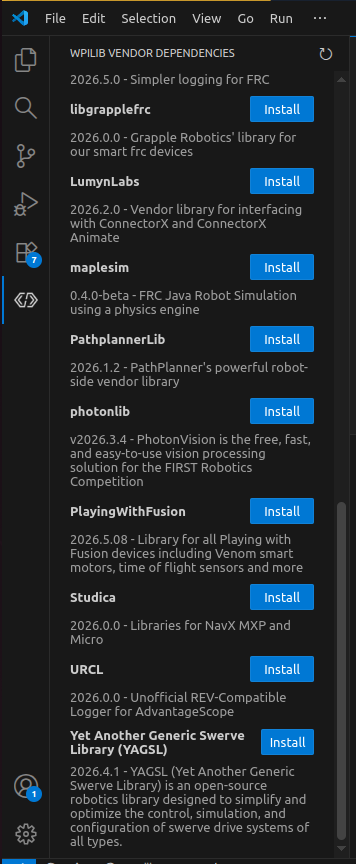

# 2. Install YAGSL

## Add the YAGSL vendordep

Installing YAGSL no longer requires typing a URL. Open the **WPILib Vendor Dependencies** panel in
the VS Code sidebar (the WPILib extension icon) — YAGSL is listed directly in the catalog alongside
the other common FRC vendor libraries (PathplannerLib, photonlib, REVLib, Studica, URCL, etc.).
Click **Install** next to it.

<figure><figcaption><p>YAGSL listed directly in the WPILib Vendor Dependencies panel.</p></figcaption></figure>

If your WPILib version doesn't have YAGSL in that catalog yet, install it the manual way instead:
open **Manage Vendor Libraries → Install new library (online)** and paste the URL:

```
https://yet-another-software-suite.github.io/YAGSL/yagsl/yagsl.json
```

Run a Gradle build afterward to pull down the library before continuing.

## Add vendordeps for your hardware

YAGSL wraps [YAMS](https://yams.yamgen.com/) and talks to hardware through each vendor's own library.
Install a vendordep for every piece of hardware your robot actually uses:

| Vendor | Needed for | URL |
|---|---|---|
| CTRE Phoenix 6 | TalonFX, TalonFXS, Pigeon 2.0, CANcoder | `https://maven.ctr-electronics.com/release/com/ctre/phoenix6/latest/Phoenix6-replay-frc2026-latest.json` |
| CTRE Phoenix 5 | TalonSRX | `https://maven.ctr-electronics.com/release/com/ctre/phoenix/Phoenix5-replay-frc2026-latest.json` |
| REVLib | SparkMAX, SparkFlex | `https://software-metadata.revrobotics.com/REVLib-2026.json` |
| Studica | NavX / NavX3 | `https://dev.studica.com/maven/release/2026/json/Studica-2026.0.0.json` |
| ReduxLib | Canandgyro, Canandmag, Canandcoder | `https://frcsdk.reduxrobotics.com/ReduxLib_2026.json` |
| maple-sim | Physics simulation (optional, recommended) | `https://shenzhen-robotics-alliance.github.io/maple-sim/vendordep/maple-sim.json` |

See the WPILib docs for the general procedure for [installing 3rd-party libraries](https://docs.wpilib.org/en/stable/docs/software/vscode-overview/3rd-party-libraries.html#installing-libraries).


Check for newer vendordep versions before every season — the URLs above track the `frc2026` line but
vendors publish updates throughout the year. Your vendor's hardware client (REV Hardware Client,
Phoenix Tuner X) is also useful for firmware updates and low-level device configuration.


Once your build succeeds with all vendordeps installed, move on to
[generating your configuration](03-generate-your-configuration.md).
